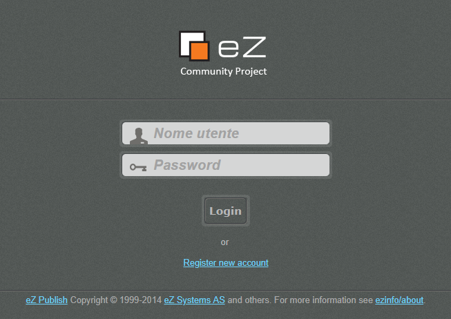
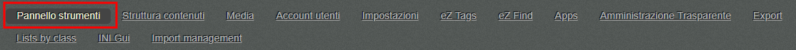
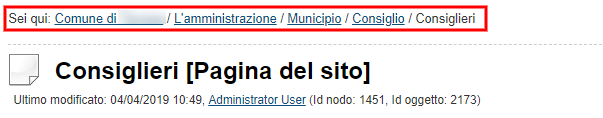
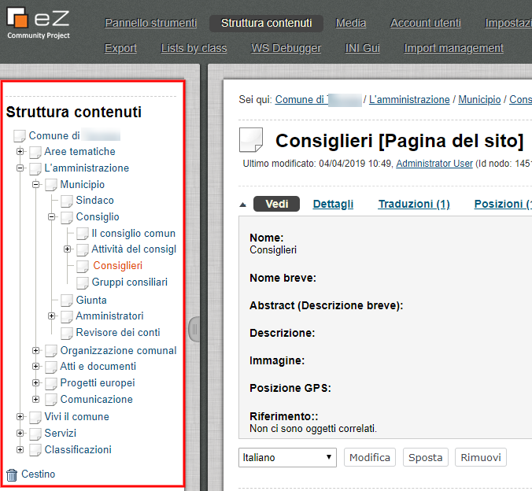
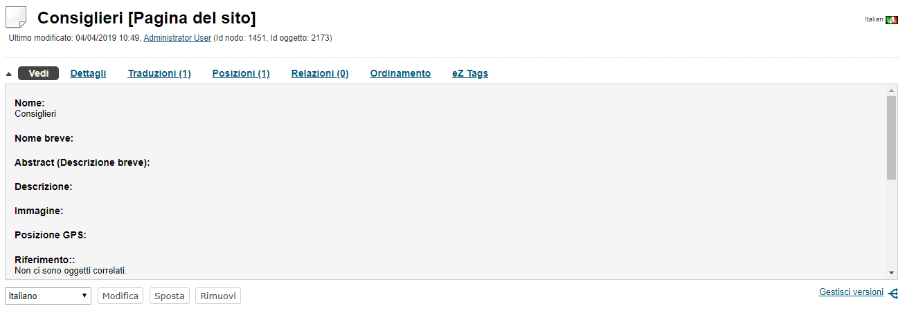
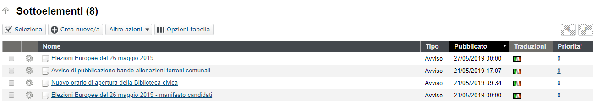
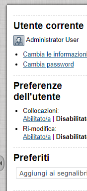
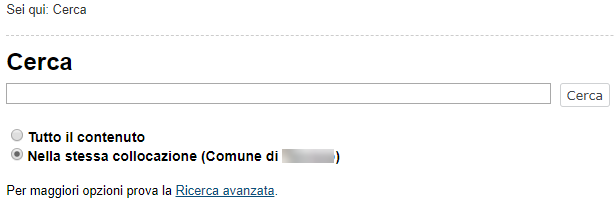

.. _h524ac94c195862726953433f2f5c7f:

Gestire i contenuti: l’interfaccia di amministrazione
*****************************************************

Lo scopo di questo capitolo è presentare una panoramica delle parti più comuni dell'\ |STYLE0|\  presente su tutti i siti appartenenti alla suite OpenPA (basati su piattaforma eZ Publish). L'interfaccia di amministrazione è composta da molte parti. Questo capitolo non tratta argomenti avanzati, ma si concentra sulle parti che sono maggiormente utilizzate da persone che si occupano della \ |STYLE1|\ .

.. _h67645d52877726a1e7944731371540:

Accesso al sistema 
===================

Ogni volta che si vuole accedere per la prima volta all’interfaccia di amministrazione, verrà visualizzata la schermata di accesso.

\ |IMG1|\ 

Questa pagina costituisce un meccanismo di sicurezza che impedisce agli utenti non autorizzati di accedere al sistema.

Per superare la pagina di accesso, il visitatore deve fornire un nome utente e una password validi.

\ |IMG2|\ 

Per avere un nome utente e una password validi, devi essere un utente registrato. 

Dopo aver digitato il nome utente e la password corretti, fai clic sul pulsante \ |STYLE2|\  ("Accedi"):

\ |IMG3|\ 

Nel caso in cui le informazioni fornite (Username o Password) non siano valide (o non siano corrette), verrà mostrato il seguente messaggio:

\ |IMG4|\ 

\ |STYLE3|\ 

.. _hf464843526245477320527c5120671:

Panoramica
==========

.. _h1f75163cc3b75124fa683052e4d0:

Pannello strumenti
------------------

Dopo aver effettuato correttamente il \ |LINK1|\ , l'interfaccia di amministrazione sarà, per impostazione predefinita, la pagina \ |STYLE4|\ .

\ |IMG5|\ 

\ |IMG6|\ 

Il Pannello Strumenti è l'\ |STYLE5|\ . Questa area consente di accedere a diversi elementi e interfacce che appartengono all'utente che ha effettuato l'accesso.

.. admonition:: Nota

    \ |STYLE6|\ 

.. _h2f6451396a283a194b374719425122:

Struttura contenuti
-------------------

La seguente schermata mostra la pagina che appare quando si fa clic sulla scheda \ |STYLE7|\ . Questa è l'area in cui, come redattore, trascorrerai la maggior parte del tuo tempo, aggiungendo e modificando i contenuti.

\ |IMG7|\ 

\ |IMG8|\ 

\ |STYLE8|\ 

Come mostrato sopra, l'interfaccia può essere divisa in 8 zone. Queste zone sono interattive e saranno sempre presenti. Sono gli elementi principali dell'interfaccia di amministrazione. Si noti che alcune zone verranno automaticamente disabilitate quando un utente attiva un'azione specifica (ad esempio, alcune parti dell'interfaccia non sono interattive durante la modifica).

L'interfaccia è composta dai seguenti elementi:

#. Menù principale

#. Menù \ |STYLE9|\  (“briciole di pane”)

#. Menù secondario

#. Area principale

#. Sotto-elementi

#. Menù a destra comprimibile

#. Motore di ricerca

#. Uscita

.. admonition:: Nota

    * Le frecce indicano le aree regolabili dello schermo. 
    
    * La freccia centrale destra indica il pulsante che permette di comprimere/espandere il menù di destra. 
    
    * La freccia centrale sinistra indica il pulsante che permette di regolare i margini del menù a sinistra. 
    
    * La freccia in alto a sinistra indica il pulsante che permette di comprimere/espandere il contenuto dell'area principale. Riducendo quest'area, si nasconde l'area centrale della scheda selezionata.

#. Menu principale

\ |IMG9|\ 

Il menu principale è una raccolta di schede situate tra il logo "eZ Publish" e il motore di ricerca. Il menu secondario (3) e l'area principale (4) mostrano gli elementi che appartengono alla scheda selezionata. Si noti che queste tre schede funzionano allo stesso modo. L'unica differenza è che danno accesso a diverse parti dell'albero dei nodi. Le schede rimanenti funzionano in modo diverso.

La seguente tabella fornisce una breve panoramica delle voci di menu disponibili insieme a una breve descrizione.

+------------------+---------------------------------------------------------------------------------------------------------------------------------------------------------------------------------------------------------------------------------------------------------------------------------------------------------------------------------------------------------------------------------------------------------------------------------------------------------------------------------------------------------------------------------------------------------------------------------------------------------------------------------------------------------------------------------------------------------+
|Voce del menù     |Descrizione                                                                                                                                                                                                                                                                                                                                                                                                                                                                                                                                                                                                                                                                                              |
+==================+=========================================================================================================================================================================================================================================================================================================================================================================================================================================================================================================================================================================================================================================================================================================+
|Pannello strumenti|Corrisponde all’\ |STYLE10|\  dell’utente. Quest’area consente di accedere a diversi elementi e interfacce che appartengono all'utente che ha effettuato l'accesso.                                                                                                                                                                                                                                                                                                                                                                                                                                                                                                                                      |
|                  |                                                                                                                                                                                                                                                                                                                                                                                                                                                                                                                                                                                                                                                                                                         |
|                  |                                                                                                                                                                                                                                                                                                                                                                                                                                                                                                                                                                                                                                                                                                         |
|                  |                                                                                                                                                                                                                                                                                                                                                                                                                                                                                                                                                                                                                                                                                                         |
+------------------+---------------------------------------------------------------------------------------------------------------------------------------------------------------------------------------------------------------------------------------------------------------------------------------------------------------------------------------------------------------------------------------------------------------------------------------------------------------------------------------------------------------------------------------------------------------------------------------------------------------------------------------------------------------------------------------------------------+
|\ |STYLE11|\      |Questa scheda porta l'utente in cima all'\ |STYLE12|\ . L’albero dei contenuti corrisponde ad una rappresentazione dei contenuti presenti sul sito web pubblico che si diramano a partire dalla pagina principale (spesso, l’Homepage).                                                                                                                                                                                                                                                                                                                                                                                                                                                                  |
|                  |                                                                                                                                                                                                                                                                                                                                                                                                                                                                                                                                                                                                                                                                                                         |
|                  |Se abilitato, il menù di sinistra (3) mostrerà invece un albero interattivo contenente i nodi che appartengono all'albero dei contenuti. L'area principale (4) visualizzerà le informazioni sul nodo di livello superiore selezionato insieme con un elenco di nodi collocati direttamente sotto di esso (5).                                                                                                                                                                                                                                                                                                                                                                                            |
+------------------+---------------------------------------------------------------------------------------------------------------------------------------------------------------------------------------------------------------------------------------------------------------------------------------------------------------------------------------------------------------------------------------------------------------------------------------------------------------------------------------------------------------------------------------------------------------------------------------------------------------------------------------------------------------------------------------------------------+
|\ |STYLE13|\      |La scheda Media (o “Libreria multimediale”) porta l'utente in cima all'\ |STYLE14|\ . Questa sezione può essere utilizzata per archiviare dati utilizzati frequentemente da altri nodi. Viene in genere utilizzato per archiviare \ |STYLE15|\ , \ |STYLE16|\  e \ |STYLE17|\  correlati ai nodi che si trovano nell'albero dei contenuti. La sezione non è accessibile all’utente esterno. Se abilitato, il menù di sinistra (3) mostrerà invece un albero interattivo contenente i nodi che appartengono all'albero dei contenuti. L'area principale (4) visualizzerà le informazioni sul nodo di livello superiore selezionato insieme con un elenco di nodi collocati direttamente sotto di esso (5).|
+------------------+---------------------------------------------------------------------------------------------------------------------------------------------------------------------------------------------------------------------------------------------------------------------------------------------------------------------------------------------------------------------------------------------------------------------------------------------------------------------------------------------------------------------------------------------------------------------------------------------------------------------------------------------------------------------------------------------------------+
|\ |STYLE18|\      |La scheda Account utenti pporta l'utente in cima all'\ |STYLE19|\ . Lo scopo di questo albero è quello di memorizzare utenti e gruppi di utenti in modo strutturato.  Se abilitato, il menù di sinistra (3) mostrerà invece un albero interattivo contenente i nodi che appartengono all'albero dei contenuti. L'area principale (4) visualizzerà le informazioni sul nodo di livello superiore selezionato insieme con un elenco di nodi collocati direttamente sotto di esso (5).                                                                                                                                                                                                                      |
+------------------+---------------------------------------------------------------------------------------------------------------------------------------------------------------------------------------------------------------------------------------------------------------------------------------------------------------------------------------------------------------------------------------------------------------------------------------------------------------------------------------------------------------------------------------------------------------------------------------------------------------------------------------------------------------------------------------------------------+
|\ |STYLE20|\      |La scheda Impostazioni porta l'utente nell'\ |STYLE21|\  principale. Questa area è per \ |STYLE22|\ .                                                                                                                                                                                                                                                                                                                                                                                                                                                                                                                                                                                                    |
+------------------+---------------------------------------------------------------------------------------------------------------------------------------------------------------------------------------------------------------------------------------------------------------------------------------------------------------------------------------------------------------------------------------------------------------------------------------------------------------------------------------------------------------------------------------------------------------------------------------------------------------------------------------------------------------------------------------------------------+

.. _h2c1d74277104e41780968148427e:

#. Menù breadcrumb (“briciole di pane”)

\ |IMG10|\ 

Percorso interattivo (2) situato proprio sotto le schede del menu principale (1). Questo percorso rivelerà sempre la posizione in cui l'utente è attualmente a prescindere dal contenuto/funzionalità a cui si accede. Il percorso è costituito da parole separate da barre. Tutti tranne l'ultimo elemento sono collegamenti, questo significa che il percorso può essere utilizzato per navigare all'indietro.

#. Menù secondario

\ |IMG11|\ 

Il menù secondario consente di accedere al contenuto e/o alle interfacce associate alla scheda selezionata nel menu principale (1). Il menù a sinistra delle prime tre schede ("Struttura contenuti", "Media" e "Account utenti") si presenta e si comporta allo stesso modo. Queste schede forniscono \ |STYLE23|\ . Quando la scheda "Struttura  contenuti" è selezionata, il menù a sinistra darà accesso all'albero dei contenuti, quando è selezionata la sezione "Media”, il menù a sinistra darà accesso all'albero dei media, ecc. Il menù a sinistra, per le schede rimanenti, si comporta diversamente e dà accesso a diverse interfacce. A differenza delle rappresentazioni ad albero, questo menù non può essere disabilitato e quindi sarà sempre visualizzato.

#. Area principale

\ |IMG12|\ L'area principale è la parte più dinamica e più importante dell'interfaccia di amministrazione. Visualizza il contenuto effettivo e/o le interfacce associate all'ultima menù selezionato. Questo è dove la maggior parte del lavoro del redattore viene svolto.

#. Sotto-elementi

\ |IMG13|\ 

L'area dei sotto-elementi visualizza le pagine secondarie, le cartelle, i contenuti multimediali, gli oggetti utente o altri oggetti contenuti all’interno della pagina principale selezionata.

L'elenco dei sotto-elementi (chiamati anche “\ |STYLE24|\ ”) ha una funzione di ordinamento che permette di ordinare i “figli” come si desidera. 

Si noti che le schede "Struttura contenuti", "Media" e "Account utenti" sono predefinite con un diverso set predefinito di colonne nella tabella dei sotto-elementi. Queste colonne possono essere personalizzate dall'utente in "Opzioni tabella" come descritto nella documentazione della scheda Struttura contenuti.

#. Menù a destra comprimibile

\ |IMG14|\ 

L'area destra è dedicata all'utente che ha effettuato l'accesso. Si tratta di un menù comprimibile. FaI clic sull'icona con la freccia per espandere/comprimere il menù. 

Questo menù rivela il nome dell'utente e fornisce collegamenti che possono essere utilizzati per modificare le informazioni e la password dell'utente. La sezione \ |STYLE25|\  contiene un elenco dei segnalibri dell'utente corrente. Questi sono i segnalibri interni al sito web che si è deciso di aggiungere. Fornisce anche un pulsante che può essere utilizzato per contrassegnare con un segnalibro il nodo attualmente visualizzato (“Aggiungi ai segnalibri”). La parte inferiore del menù a destra contiene inoltre strumenti per sviluppatori.

#. Motore di ricerca

\ |IMG15|\ 

Il motore di ricerca si trova nell'angolo in alto a destra. È sempre presente e può essere utilizzato per la ricerca indipendentemente dalla sezione in cui ci si trova. Il motore di ricerca viene disabilitato ogni volta che l'interfaccia è in modalità \ |STYLE26|\  (ad esempio, quando un oggetto viene modificato). 

Il comportamento predefinito del motore di ricerca è che il sistema cercherà le parole specificate all'interno dell'intero albero dei nodi. 

Il pulsante di opzione "Nella stessa collocazione" consente di limitare la ricerca solo a uno dei tre principali nodi (e a tutti gli elementi sottostanti) che viene visualizzato in quel momento (es.: Struttura contenuti, Media, Utenti).

\ |IMG16|\ 

#. Uscita

\ |IMG17|\ 

Il pulsante \ |STYLE27|\  può essere utilizzato per terminare la sessione disconnettendosi dal sistema.

.. _h2c1d74277104e41780968148427e:

 

.. _h2c1d74277104e41780968148427e:

.. bottom of content

.. |STYLE0| replace:: **interfaccia di amministrazione**

.. |STYLE1| replace:: **gestione dei contenuti**

.. |STYLE2| replace:: **Login**

.. |STYLE3| replace:: *Messaggio di accesso non riuscito*

.. |STYLE4| replace:: **Pannello Strumenti**

.. |STYLE5| replace:: **area personale degli utenti**

.. |STYLE6| replace:: *La prossima volta che effettui il login, la pagina iniziale sarà, per impostazione predefinita, la pagina in cui hai lavorato per ultima.*

.. |STYLE7| replace:: **Struttura contenuti**

.. |STYLE8| replace:: *Nota: le opzioni mostrate dipendono dai diritti dell'utente che accede.*

.. |STYLE9| replace:: *breadcrumb*

.. |STYLE10| replace:: **area personale**

.. |STYLE11| replace:: **Struttura contenuti**

.. |STYLE12| replace:: **albero dei contenuti**

.. |STYLE13| replace:: **Media**

.. |STYLE14| replace:: **albero dei Media**

.. |STYLE15| replace:: **immagini**

.. |STYLE16| replace:: **animazioni**

.. |STYLE17| replace:: **documenti**

.. |STYLE18| replace:: **Account utenti**

.. |STYLE19| replace:: **albero degli Utenti**

.. |STYLE20| replace:: **Impostazioni**

.. |STYLE21| replace:: **area di configurazione**

.. |STYLE22| replace:: **utenti esperti**

.. |STYLE23| replace:: **accesso a diverse parti dell'albero dei nodi**

.. |STYLE24| replace:: **figli**

.. |STYLE25| replace:: **Preferiti**

.. |STYLE26| replace:: *modifica*

.. |STYLE27| replace:: **Scollegati**

.. |LINK1| raw:: html

    <a href="#heading=h.p3mrka7hvlgn">login</a>

.. |IMG2| image:: static/Gestione_contenuti_amministratore_2.png
   :height: 188 px
   :width: 344 px

.. |IMG3| image:: static/Gestione_contenuti_amministratore_3.png
   :height: 188 px
   :width: 344 px

.. |IMG4| image:: static/Gestione_contenuti_amministratore_4.png
   :height: 178 px
   :width: 561 px

.. |IMG6| image:: static/Gestione_contenuti_amministratore_6.png
   :height: 253 px
   :width: 624 px

.. |IMG7| image:: static/Gestione_contenuti_amministratore_7.png
   :height: 41 px
   :width: 624 px

.. |IMG8| image:: static/Gestione_contenuti_amministratore_8.jpeg
   :height: 309 px
   :width: 624 px

.. |IMG14| image:: static/Gestione_contenuti_amministratore_14.png
   :height: 381 px
   :width: 174 px

.. |IMG16| image:: static/Gestione_contenuti_amministratore_16.png
   :height: 204 px
   :width: 613 px

.. |IMG17| image:: static/Gestione_contenuti_amministratore_17.png
   :height: 62 px
   :width: 380 px
