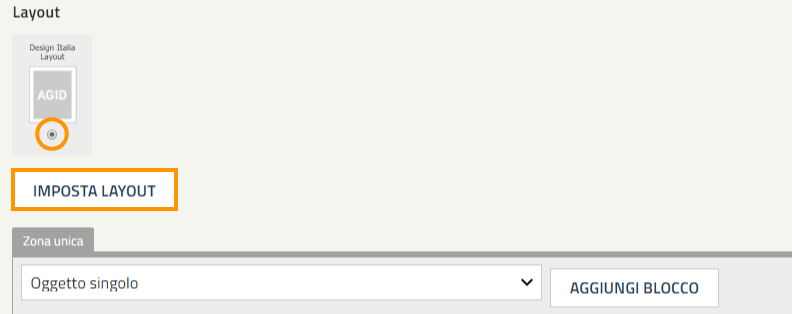
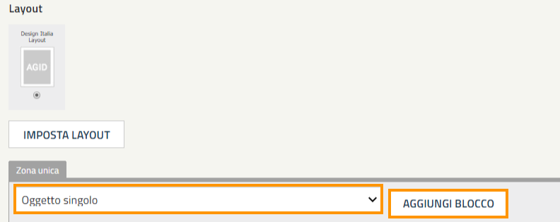
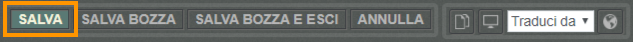

.. _h5b2d791843252d436c44807f5e712858:

Utilizza i blocchi per personalizzare l’Homepage o una Pagina del sito
======================================================================

.. _hf464843526245477320527c5120671:

Panoramica
----------

Alcune classi - come l’Homepage, la Frontpage e la Pagina del sito - supportano la gestione del Layout attraverso l’utilizzo dei blocchi.

.. admonition:: Nota

    Un \ |STYLE0|\  è un contenitore (box) che permette di mostrare uno o più contenuti - pubblicati nel sito e collocati all’interno dell’albero dei contenuti - attraverso delle regole che è possibile definire in fase di configurazione o modificare successivamente.

Per aggiungere un blocco segui i seguenti passaggi:

#. Collocati sull'attributo Layout e controlla che il Layout Design Italia sia selezionato. Se non lo è, selezionare "Design Italia Layout" e cliccare su "Imposta Layout".

\ |IMG1|\ 

#. Nella parte sottostante seleziona il blocco che desideri inserire e clicca su Aggiungi blocco".

\ |IMG2|\ 

#. Configura il blocco.

#. Pubblica il contenuto.

\ |IMG3|\ 

.. bottom of content

.. |STYLE0| replace:: **blocco**

