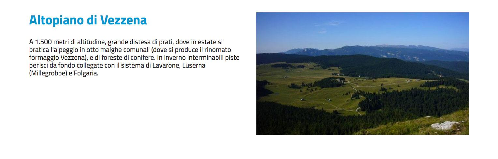

.. _h5b2d791843252d436c44807f5e712858:

Utilizza i blocchi per personalizzare l’Homepage o una Pagina del sito
======================================================================

.. _hf464843526245477320527c5120671:

Panoramica
----------

Alcune classi - come l’Homepage, la Frontpage e la Pagina del sito - supportano la gestione del Layout attraverso l’utilizzo dei blocchi.

.. admonition:: Nota

    Un \ |STYLE0|\  è un contenitore (box) che permette di mostrare uno o più contenuti - pubblicati nel sito e collocati all’interno dell’albero dei contenuti - attraverso delle regole che è possibile definire in fase di configurazione o modificare successivamente.

Per aggiungere un blocco segui i seguenti passaggi:

#. Collocati sull'attributo Layout e controlla che il Layout Design Italia sia selezionato. Se non lo è, selezionare "Design Italia Layout" e cliccare su "Imposta Layout".

\ |IMG1|\ 

#. Nella parte sottostante seleziona il blocco che desideri inserire e clicca su Aggiungi blocco".

\ |IMG2|\ 

#. Configura il blocco.

#. Pubblica il contenuto.

\ |IMG3|\ 

.. _h11463f11d25257d421058164d5c6216:

Blocco singolo
--------------

Selezione di un singolo oggetto

.. _h7a19202a115655405a60135a11184467:

Default
~~~~~~~

Titolo e abstract a sinistra Immagine a destra. 

Se il contenuto non ha l’immagine l’abstract occupa tutto l’ingombro

\ |IMG4|\ 

.. _h712b773e21122268615f80427587773:

Banner/Link
^^^^^^^^^^^

Se l’oggetto è un banner o un link

\ |IMG5|\ 

Se nel link o nel banner non c’è immagine viene esposto un pulsantone con background colorato e testo bianco

.. _h2853a65f2843553c4e2cb4b6f4b:

\ |IMG6|\ ==========

.. _h5c6d31d30291e12117f18303326772e:

Gallery
^^^^^^^

Se l’oggetto è una galleria \ |STYLE1|\ 

\ |IMG7|\ 

.. _h3c2a1e6b4f599172c2e2063691a54e:

Amministrazione trasparente
^^^^^^^^^^^^^^^^^^^^^^^^^^^

\ |IMG8|\ 

.. _h793d5d52f5b327c4821533d105e2347:

Titolo del blocco o dell’oggetto, miniatura e abstract
~~~~~~~~~~~~~~~~~~~~~~~~~~~~~~~~~~~~~~~~~~~~~~~~~~~~~~

\ |IMG9|\ 

.. _h48266df4b10627d35b78216968722e:

Panel
~~~~~

\ |IMG10|\ 

.. _h6fe6716761163246c2e72721a197e:

Banner
~~~~~~

\ |IMG11|\ 

.. _h32326a1177164785e7e5511db8073:

In evidenza
~~~~~~~~~~~

\ |IMG12|\ 

.. _h2c1d74277104e41780968148427e:

.. _h2c1d74277104e41780968148427e:

.. _ha437e453681612161612158575267:

Lista automatica
----------------

Selezione del nodo padre, possibilità di filtrare ed ordinare i figli del nodo passato come genitore.

.. _h225bd2729b5f536b2e442259197a52:

Carousel
~~~~~~~~

\ |IMG13|\ 

.. _h4d5a52b2176b4a2fc513b6643430:

Accordion
~~~~~~~~~

\ |IMG14|\ 

.. _h25294ec1f554534b464e1e3d317e40:

Elenco
~~~~~~

\ |IMG15|\ 

.. _h2d6566764f50424b1fe1b2f3263b61:

Slider
~~~~~~

\ |IMG16|\ 

.. _h5647777d3a38475e3b592656276fb14:

Masonry
~~~~~~~

\ |IMG17|\ 

.. _h6fe6716761163246c2e72721a197e:

Banner
~~~~~~

\ |IMG18|\ 

.. _h32326a1177164785e7e5511db8073:

In evidenza
~~~~~~~~~~~

\ |IMG19|\ 

.. _h7f3332d11511d3d543639785d345f:

Lista manuale
-------------

Selezione manuale di massimo 5 elementi

.. _h4d5a52b2176b4a2fc513b6643430:

Accordion
~~~~~~~~~

\ |IMG20|\ 

.. _h32307a597018792c57d252b6f59401f:

Elenco ultimi 4 figli 
~~~~~~~~~~~~~~~~~~~~~~

\ |IMG21|\ 

.. _h40117d10496d54353546257a7a13439:

Elenco su due colonne
~~~~~~~~~~~~~~~~~~~~~

\ |IMG22|\ 

.. _h7015777b347a33c5e481931d625040:

Tabs
~~~~

\ |IMG23|\ 

.. _h2d6566764f50424b1fe1b2f3263b61:

Slider
~~~~~~

\ |IMG24|\ 

.. _h32326a1177164785e7e5511db8073:

In evidenza
~~~~~~~~~~~

\ |IMG25|\ 

.. _h5647777d3a38475e3b592656276fb14:

Masonry
~~~~~~~

\ |IMG26|\ 

.. _h5151374a254c4a24f1275507dfd:

Maps
----

Selezione di un contenitore

.. _h31735759454e6a13612b695719321056:

Open street map
~~~~~~~~~~~~~~~

\ |IMG27|\ 

.. _h1a39193865195c181462595a354c02b:

Eventi
------

Selezione di un contenitore (calendario)

.. _h7015777b347a33c5e481931d625040:

Tabs
~~~~

\ |IMG28|\ 

.. _h225bd2729b5f536b2e442259197a52:

Carousel
~~~~~~~~

\ |IMG29|\ 

.. _h51164662845596a185f716a411e4369:

Wide 
~~~~~

\ |IMG30|\ 

.. _h2c1d74277104e41780968148427e:

.. bottom of content

.. |STYLE0| replace:: **blocco**

.. |STYLE1| replace:: *(c’è ambiguità perché parliamo di oggetto singolo ma in realtà ne mostriamo i figli?)*

.. |IMG1| image:: static/Blocchi_Opencity_1.png
   :height: 222 px
   :width: 564 px

.. |IMG2| image:: static/Blocchi_Opencity_2.png
   :height: 212 px
   :width: 534 px

.. |IMG3| image:: static/Blocchi_Opencity_3.png
   :height: 28 px
   :width: 413 px

.. |IMG5| image:: static/Blocchi_Opencity_5.jpeg
   :height: 77 px
   :width: 601 px

.. |IMG6| image:: static/Blocchi_Opencity_6.jpeg
   :height: 65 px
   :width: 601 px

.. |IMG7| image:: static/Blocchi_Opencity_7.jpeg
   :height: 178 px
   :width: 601 px

.. |IMG8| image:: static/Blocchi_Opencity_8.jpeg
   :height: 94 px
   :width: 601 px

.. |IMG9| image:: static/Blocchi_Opencity_9.jpeg
   :height: 100 px
   :width: 601 px

.. |IMG10| image:: static/Blocchi_Opencity_10.jpeg
   :height: 388 px
   :width: 601 px

.. |IMG11| image:: static/Blocchi_Opencity_11.jpeg
   :height: 142 px
   :width: 601 px

.. |IMG12| image:: static/Blocchi_Opencity_12.jpeg
   :height: 244 px
   :width: 601 px

.. |IMG13| image:: static/Blocchi_Opencity_13.jpeg
   :height: 409 px
   :width: 601 px

.. |IMG14| image:: static/Blocchi_Opencity_14.jpeg
   :height: 157 px
   :width: 601 px

.. |IMG15| image:: static/Blocchi_Opencity_15.jpeg
   :height: 266 px
   :width: 601 px

.. |IMG16| image:: static/Blocchi_Opencity_16.jpeg
   :height: 196 px
   :width: 601 px

.. |IMG17| image:: static/Blocchi_Opencity_17.jpeg
   :height: 506 px
   :width: 601 px

.. |IMG18| image:: static/Blocchi_Opencity_18.jpeg
   :height: 364 px
   :width: 601 px

.. |IMG19| image:: static/Blocchi_Opencity_19.jpeg
   :height: 265 px
   :width: 601 px

.. |IMG20| image:: static/Blocchi_Opencity_14.jpeg
   :height: 157 px
   :width: 601 px

.. |IMG21| image:: static/Blocchi_Opencity_20.jpeg
   :height: 160 px
   :width: 601 px

.. |IMG22| image:: static/Blocchi_Opencity_21.jpeg
   :height: 424 px
   :width: 601 px

.. |IMG23| image:: static/Blocchi_Opencity_22.jpeg
   :height: 113 px
   :width: 601 px

.. |IMG24| image:: static/Blocchi_Opencity_16.jpeg
   :height: 196 px
   :width: 601 px

.. |IMG25| image:: static/Blocchi_Opencity_19.jpeg
   :height: 265 px
   :width: 601 px

.. |IMG26| image:: static/Blocchi_Opencity_17.jpeg
   :height: 506 px
   :width: 601 px

.. |IMG27| image:: static/Blocchi_Opencity_23.jpeg
   :height: 213 px
   :width: 601 px

.. |IMG28| image:: static/Blocchi_Opencity_24.jpeg
   :height: 173 px
   :width: 601 px

.. |IMG29| image:: static/Blocchi_Opencity_25.jpeg
   :height: 328 px
   :width: 601 px

.. |IMG30| image:: static/Blocchi_Opencity_26.jpeg
   :height: 288 px
   :width: 601 px
