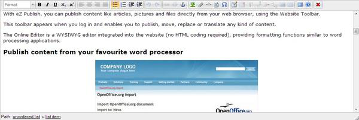

.. _h1d702a1d12456626641e4c30244166:

Personalizza i tuoi testi 
**************************

.. _h4f6c2911a4178503d30662c55756643:

Panoramica: l’Editor online
===========================

.. _h761ab401543201137a78553757464:

\ |IMG1|\ **********

L'Editor online è un’estensione che si trova installata su tutti i siti web della suite OpenPA (basati su piattaforma eZ Publish). Consente di \ |STYLE0|\  utilizzando un'interfaccia intuitiva. 

Con l'Editor online puoi facilmente personalizzare e ottimizzare - dal punto di vista della formattazione - grandi sezioni di testo inserite all’interno dei tuoi articoli e/o della tue pagine del sito: esso consente infatti di inserire \ |STYLE1|\  e \ |STYLE2|\ , di aggiungere \ |STYLE3|\ , creare \ |STYLE4|\  e molto altro ancora. 

\ |STYLE5|\ 

L’Editor online converte automaticamente ttute le tue istruzioni in \ |STYLE6|\  eZ Publish, un formato molto facile da esportare su canali diversi, senza che tu mai debba lavorare direttamente sul codice XML.

L'interfaccia dell’Editor online infatti è molto simile a quella che si trova in molti editor di testo (es.: Microsoft Word, LibreOffice Writer, OpenOffice Writer, Google Documents).

L'Editor online, inoltre, \ |STYLE7|\ . In altre parole, è possibile creare collegamenti/titoli/tabelle/elenchi ecc., ma non è possibile impostare direttamente i loro colori o altre specifiche relative al layout. (L’impostazione grafica viene decisa dallo sviluppatore a livello di template).

Grazie all’Editor online sono supportate le seguenti opzioni di formattazione:

* Formati di testo e titoli

* Testo in grassetto

* Testo in corsivo

* Testo sottolineato

* Sub-script

* Super-script

* Liste ordinate (numerate)

* Liste non ordinate (elenco puntato)

* Collegamenti ipertestuali

* Ancore

* Oggetti incorporati (immagini e oggetti)

* Tag personalizzati

* Testo letterale

* Tabelle

* Tabella righe e colonne

* Celle di intestazione della tabella

* Unisci/dividi celle

* Linee e paragrafi

.. _h4f451185029547d38734478361d5051:

La barra degli strumenti 
=========================

La barra degli strumenti dell’online Editor contiene strumenti per la modifica del contenuto che viene visualizzato nell'area di testo sottostante. I pulsanti sono molto simili a quelli presenti in molti Editor di testo (es.: Microsoft Word). 

Ad esempio, se selezioni una parte di testo e fai clic sul pulsante \ |STYLE8|\ , il testo selezionato diventerà grassetto. 

La seguente schermata mostra i diversi pulsanti:

\ |IMG2|\ 

\ |IMG3|\ 

.. _h195511344f4a5c69502674a63e7e74:

Ridimensiona l'area di testo
----------------------------

Il testo formattato viene inserito in un'\ |STYLE9|\  multilinea modificabile.

È possibile modificare l'altezza dell'area di testo dell’Editor online trascinando la maniglia di ridimensionamento situata nell'angolo in basso a destra dell'interfaccia.

\ |IMG4|\ 

.. _h3944f29446246664579191a6b80a38:

Visualizza i suggerimenti dei pulsanti
--------------------------------------

Ogni pulsante ha un suggerimento che viene visualizzato quando il puntatore del mouse si posiziona sopra il pulsante stesso. I suggerimenti vengono utilizzati per fornire ulteriori informazioni sull'azione che verrà eseguita dal pulsante quando si fa clic. Lo screenshot qui sotto ne è un esempio.

\ |IMG5|\ 

I pulsanti della barra degli strumenti temporaneamente disabilitati dispongono ancora di suggerimenti sul comando, ma non è possibile fare clic sui pulsanti come mostrato nell'immagine seguente.

\ |IMG6|\ 

.. _h5c753b115859025631267f56753646:

Inserisci allegati all'interno del testo
----------------------------------------

All'interno del campo dove è possibile inserire testo formattato (ad esempio il corpo dell'articolo) nella barra degli strumenti. Si utilizza l'icona con la graffetta (1) per allegare un file, che viene visualizzato nella posizione in cui si trova il cursore dentro il campo (2).

\ |IMG7|\ 

Facendo clic sulla graffetta, si aprirà una finestra che consente di caricare un file (carica) oppure scegliere un oggetto già presente a sistema (cerca, naviga, preferiti).

.. _h2c1d74277104e41780968148427e:

.. bottom of content

.. |STYLE0| replace:: **formattare il testo**

.. |STYLE1| replace:: **immagini**

.. |STYLE2| replace:: **tabelle**

.. |STYLE3| replace:: **collegamenti**

.. |STYLE4| replace:: **elenchi puntati e ordinati**

.. |STYLE5| replace:: **Come funziona?**

.. |STYLE6| replace:: *codice XML*

.. |STYLE7| replace:: **formatta il testo a un livello logico**

.. |STYLE8| replace:: **Grassetto**

.. |STYLE9| replace:: **area di testo**

.. |IMG2| image:: static/editor_online_2.png
   :height: 18 px
   :width: 600 px

.. |IMG3| image:: static/editor_online_3.png
   :height: 149 px
   :width: 600 px

.. |IMG4| image:: static/editor_online_4.png
   :height: 258 px
   :width: 600 px

.. |IMG5| image:: static/editor_online_5.png
   :height: 64 px
   :width: 168 px

.. |IMG6| image:: static/editor_online_6.png
   :height: 64 px
   :width: 165 px

.. |IMG7| image:: static/editor_online_7.png
   :height: 313 px
   :width: 616 px
