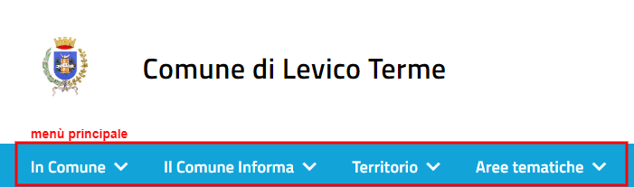
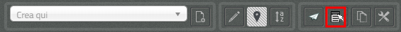

.. _h2c1d74277104e41780968148427e:

.. _h256f44685f63564426473c5e2876461:

Personalizza il tuo sito OpenCity
*********************************

.. _h6f5150673f2401a4b21804d4b464224:

Aspetto estetico del sito web
=============================

Dal punto di vista del design, un sito web basato su \ |STYLE0|\  è allineato all’iniziativa \ |LINK1|\ . Il sito risulta accessibile e ottimizzato per la lettura da dispositivi mobili (smartphone, tablet)

\ |IMG1|\ 

\ |STYLE1|\ 

.. _hf46106a6b6e4355d545e4210117e3:

Personalizza l’Homepage
=======================

.. _h2878256a793dd584a14e7776663c4a:

Classi di contenuto
===================

In totale nel sistema OpenCity sono presenti circa \ |STYLE2|\ .

A titolo esemplificativo, vengono elencate sotto alcune delle più rilevanti classi di contenuto, suddivise per tipologia:

+-------------+------------------------------------------------------------------------------------------------------+
|Comunicazione|Avviso, Calendario, Comunicato stampa, Evento                                                         |
+-------------+------------------------------------------------------------------------------------------------------+
|\ |STYLE3|\  |Area tematica, Cartella, Frontpage, Homepage, Pagina del sito                                         |
+-------------+------------------------------------------------------------------------------------------------------+
|\ |STYLE4|\  |Circolare, Disciplinare, Modulistica, Procedura, Utilità                                              |
+-------------+------------------------------------------------------------------------------------------------------+
|\ |STYLE5|\  |Area, Organigramma, Ruolo, Servizio, Struttura, Ufficio                                               |
+-------------+------------------------------------------------------------------------------------------------------+
|\ |STYLE6|\  |Gruppo consiliare, Interpellanza, Interrogazione, Lista elettorale, Organo Politico, Politico, Sindaco|
+-------------+------------------------------------------------------------------------------------------------------+
|\ |STYLE7|\  |Associazione, Azienda, Punto di interesse, Servizio sul territorio, Struttura ricettiva               |
+-------------+------------------------------------------------------------------------------------------------------+

La seguenti sezione descrive alcune classe di contenuto disponibili nei siti OpenPA. Come descritto sopra, l'elenco delle classi di contenuti visualizzate nell'elenco a discesa varia in base all'oggetto di contenuto attualmente visualizzato e se si è effettuato l'accesso con un account utente che appartiene a un gruppo di Editor o Amministratori.

.. _h131416c38f4e74417616c8475340:

Pagina del sito 
----------------

La \ |LINK2|\  è una \ |LINK3|\  tra le più comunemente utilizzate. Viene utilizzata per contenuti generici, non molto strutturati, oppure come \ |STYLE8|\ . 

Per \ |LINK4|\ , selezionare Pagina del sito dal menu a discesa nella \ |LINK5|\  del sito Web, quindi fare clic sul pulsante Crea.

.. _ha74627d763497d63d685d57631276:

Modalità di visualizzazione dei figli
~~~~~~~~~~~~~~~~~~~~~~~~~~~~~~~~~~~~~

Una volta inseriti i contenuti sotto una pagina del sito, è possibile selezionare il tipo di visualizzazione da applicare ai figli: questo offre diverse possibilità a seconda dello scopo della pagina.

Ad esempio è possibile Creare una pagina del sito per mostrare un elenco di strutture di servizio dislocate sul territorio, strutturando i contenuti come segue:

* Servizi sul territorio [Pagina del sito]

    * Centro educazione ambientale [Punto di interesse]

    * Farmacia XX [Servizio sul territorio]

    * Biblioteca Comunale [Servizio sul territorio]

    * Parafarmacia [Servizio sul territorio]

    * …

La visualizzazione degli oggetti “figli” di una pagina del sito è impostata di default come una “lista”, ma è possibile scegliere tra diverse altre modalità: in fase di \ |LINK6|\  o di \ |LINK7|\ , tra gli attributi della pagina si trova, in fondo, l’attributo \ |STYLE9|\ .

\ |IMG2|\ 

Le scelte possibili sono:

* \ |STYLE10|\  - visualizzazione a lista;

* \ |STYLE11|\  -  visualizzazione a tabella con informazioni minime su ogni contenuto;

* \ |STYLE12|\  - sulla destra vengono proposti dei filtri per effettuare delle ricerche sui contenuti (un filtro per ogni tipologia di contenuto) utile in caso di gran numero di contenuti dello stesso tipo;

* \ |STYLE13|\  - i contenuti “figli” vengono mostrati su una mappa (sulla mappa vengono mostrati solo gli oggetti per cui è stata specificata una geolocalizzazione);

* \ |STYLE14|\  - vengono mostrati dei pannelli, uno per contenuto;

* \ |STYLE15|\  - i contenuti vengono mostrati con dei pannelli, ma vicino al titolo viene mostrata una icona.

\ |IMG3|\ 

\ |STYLE16|\ 

.. _h2c1d74277104e41780968148427e:

.. _h532d4d6d54247b5019a742a6d1c186c:

Inserisci l’organigramma della tua struttura
--------------------------------------------

.. _h201f103596e646a163d386454463551:

Come funziona
~~~~~~~~~~~~~

La visualizzazione di un Organigramma viene gestita partendo da una serie di oggetti e dalle relazioni che intercorrono tra di loro.

Tipicamente, nella struttura dei contenuti di un sito OpenCity, sono presenti i seguenti contenitori:

* \ |STYLE17|\ : contiene oggetti di tipo “Area”, che rappresentano le aree nelle quali è divisa l’organizzazione dell’ente.

* \ |STYLE18|\ : contiene oggetti di tipo “Servizio”, che rappresentano i Servizi operanti all’interno dell’ente.

* \ |STYLE19|\ : contiene oggetti di tipo “Ufficio”, che rappresentano gli uffici fisici dell’ente.

Ogni ufficio contiene un riferimento ad un servizio, ed ogni servizio contiene un riferimento ad un’area. Attraverso questi riferimenti viene costruito l’albero che compare poi nell’organigramma.

\ |IMG4|\ 

\ |STYLE20|\ 

Potrebbero esserci casi (enti di piccole dimensioni) in cui non ci siano tre livelli organizzativi, in quel caso l’organigramma può essere generato seguendo soltanto i collegamenti tra Servizi e Uffici.

\ |IMG5|\ 

\ |STYLE21|\ 

.. _h2c1d74277104e41780968148427e:

.. _h4a505c44654d271f804d3844784d4d40:

Creare un organigramma
~~~~~~~~~~~~~~~~~~~~~~

Se non già presente sul sistema OpenCity un oggetto di tipo Organigramma è necessario crearne uno utilizzando proprio la classe di contenuto \ |STYLE22|\ . 

Per creare un oggetto di tipo Organigramma vedere la sezione \ |LINK8|\ .

.. _h7c175c3c7122d68524e227c661942:

Costruire un organigramma
~~~~~~~~~~~~~~~~~~~~~~~~~

Per costruire l’organigramma della tua struttura è necessario seguire i seguenti passi:

* Creare un oggetto di tipo \ |STYLE23|\  per ogni Area che fa parte della tua struttura all’interno della cartella Area presente sul sistema (attenzione: si consiglia di non cancellare mai questa cartella poichè è il nodo da cui prende origine l’organigramma). \ |STYLE24|\ .

* Creare un oggetto di tipo \ |STYLE25|\  per ogni Servizio che fa parte della tua struttura all’interno della cartella Servizi presente sul sistema (se non c’è puoi crearne una, utilizzando la classe contenitore Pagina del sito) e collegare ogni Servizio con l’Area di riferimento relativa.

* Creare un oggetto di tipo \ |STYLE26|\  per ogni Ufficio che fa parte della tua struttura all’interno della cartella Uffici presente sul sistema (se non c’è puoi crearne una, utilizzando la classe contenitore Pagina del sito) e collegare ogni Ufficio con il Servizio di riferimento relativo.

* Posizionarsi sul nodo dell’\ |STYLE27|\  (se non presente, vedi sopra come \ |LINK9|\ ), aprire le \ |STYLE28|\  con l’icona “i” in alto a destra sulla barra degli strumenti, e poi premere il pulsante \ |STYLE29|\ .

\ |IMG6|\ 

.. admonition:: Suggerimento

    Se la pressione del pulsante “Aggiorna organigramma” non dovesse sortire l’effetto desiderato, provare a modificare il contenuto di tipo organigramma (premendo l’icona con la matita sulla barra strumenti) e poi salvare senza apportare modifiche. Una volta usciti dalla modalità di modifica, premere nuovamente il pulsante “aggiorna organigramma”.

.. _h637805d197e7916372a6784062275a:

Aggiornare l’organigramma 
~~~~~~~~~~~~~~~~~~~~~~~~~~

Per aggiornare l’organigramma relativo alla tua struttura è necessario seguire i seguenti passi:

* Modificare le informazioni relative alle \ |STYLE30|\  per ogni Area che desideri modificare (vedi la sezione come \ |LINK10|\ )

* Modificare le informazioni relative ai \ |STYLE31|\  o eventualmente le relazioni con le aree per ogni Servizio o relazione che desideri modificare (vedi la sezione come \ |LINK11|\ )

* Modificare le informazioni relative agli \ |STYLE32|\  o eventualmente le relazioni con i Servizi per ogni Ufficio o relazione che desideri modificare (vedi la sezione come \ |LINK12|\ )

* Posizionarsi sul nodo dell’\ |STYLE33|\ , aprire le \ |STYLE34|\  con l’icona “i” in alto a destra sulla barra degli strumenti, e poi premere il pulsante \ |STYLE35|\ .

\ |IMG7|\ 

.. admonition:: Suggerimento

    Se la pressione del pulsante “Aggiorna organigramma” non dovesse sortire l’effetto desiderato, provare a modificare il contenuto di tipo organigramma (premendo l’icona con la matita sulla barra strumenti) e poi salvare senza apportare modifiche. Una volta usciti dalla modalità di modifica, premere nuovamente il pulsante “aggiorna organigramma”.

.. _h56733513cc4274f186abd7f4548:

Menu principale
---------------

.. _h19761121312e4621493e1172595d3630:

Modificare il menu principale
~~~~~~~~~~~~~~~~~~~~~~~~~~~~~

\ |IMG8|\ 

Il menu principale può essere gestito attraverso l’interfaccia di modifica della Homepage del sito. Bisogna perciò navigare verso la Homepage e poi premere sul pulsante \ |STYLE36|\  della barra degli strumenti.

\ |IMG9|\ 

Si aprirà l’interfaccia di modifica della Homepage, la cui classe di contenuto è denominata proprio \ |STYLE37|\ .  Spostandosi verso il basso, si incontra l’attributo \ |STYLE38|\  che consente di gestire il menu principale. Da qui è possibile eseguire le seguenti operazioni:

* dare un ordine di priorità alle voci esistenti (1)

* cancellare alcune delle voci esistenti (2,3)

* aggiungere contenuti - attraverso la modalità sfoglia (4)  o ricerca (5) - che diventeranno voci di menu

\ |IMG10|\ 

Nel menu vengono aggiunti di fatto dei link a dei contenuti già esistenti nel sito (e collocati all’interno dell’albero dei contenuti). 

.. admonition:: Nota!

    Se si vuole invece \ |STYLE39|\  bisognerà andare a modificarlo attraverso l’interfaccia di modifica della pagina relativa (es.: Il Comune).
    Per fare questo si veda il capitolo relativo \ |LINK13|\ .

Dopo aver apportato le modifiche desiderate, cliccare sul pulsante \ |STYLE40|\  in alto per pubblicare la nuova versione dell’Homepage.

.. _h5ec6c6f634d3d4b16575d7d7a465e:

Aggiornare il menu principale
~~~~~~~~~~~~~~~~~~~~~~~~~~~~~

\ |IMG11|\ 

Dopo aver apportato una modifica al menu, o ai contenuti che fanno parte del menu, potrebbe succedere che le modifiche non vengano recepite immediatamente dal sistema (il quale è dotato di un sistema di memoria \ |STYLE41|\ ). In questi casi è necessario effettuare un \ |STYLE42|\  per rendere effettive le modifiche. Questa operazione è possibile attraverso il pulsante \ |STYLE43|\  presente nella barra degli strumenti. 

.. bottom of content

.. |STYLE0| replace:: **OpenCity**

.. |STYLE1| replace:: *Il Design di Open City è allineato a Design Italia*

.. |STYLE2| replace:: **200 classi di contenuto**

.. |STYLE3| replace:: **Contenitori di base**

.. |STYLE4| replace:: **Intranet**

.. |STYLE5| replace:: **Organizzazione**

.. |STYLE6| replace:: **Politica**

.. |STYLE7| replace:: **Territorio**

.. |STYLE8| replace:: **contenitore di contenuti**

.. |STYLE9| replace:: **Visualizzazione dei figli**

.. |STYLE10| replace:: **Default**

.. |STYLE11| replace:: **Datatable**

.. |STYLE12| replace:: **Filters**

.. |STYLE13| replace:: **Map**

.. |STYLE14| replace:: **Panels**

.. |STYLE15| replace:: **Icons**

.. |STYLE16| replace:: *Il sistema consente diverse tipologie di visualizzazione per gli oggetti contenuti in una pagina*

.. |STYLE17| replace:: **Aree**

.. |STYLE18| replace:: **Servizi**

.. |STYLE19| replace:: **Uffici**

.. |STYLE20| replace:: *Attraverso la struttura e le relazioni viene generato l’organigramma*

.. |STYLE21| replace:: *Esempio di organigramma a due livelli (Servizi, Uffici)*

.. |STYLE22| replace:: **Organigramma**

.. |STYLE23| replace:: **Area**

.. |STYLE24| replace:: *Se la tua struttura non prevede l’organizzazione in aree, puoi saltare questo passaggio*

.. |STYLE25| replace:: **Servizio**

.. |STYLE26| replace:: **Ufficio**

.. |STYLE27| replace:: **Organigramma**

.. |STYLE28| replace:: **Informazioni per l’editor**

.. |STYLE29| replace:: **Aggiorna organigramma**

.. |STYLE30| replace:: **Aree**

.. |STYLE31| replace:: **Servizi**

.. |STYLE32| replace:: **Uffici**

.. |STYLE33| replace:: **Organigramma**

.. |STYLE34| replace:: **Informazioni per l’editor**

.. |STYLE35| replace:: **Aggiorna organigramma**

.. |STYLE36| replace:: **Modifica**

.. |STYLE37| replace:: **Homepage**

.. |STYLE38| replace:: **Link al menu orizzontale**

.. |STYLE39| replace:: **modificare il testo che compare nel menu**

.. |STYLE40| replace:: **Salva**

.. |STYLE41| replace:: *cache*

.. |STYLE42| replace:: **refresh del menu**

.. |STYLE43| replace:: **Aggiorna i menu**

.. |LINK1| raw:: html

    <a href="https://designers.italia.it/" target="_blank">Design Italia di AgID</a>

.. |LINK2| raw:: html

    <a href="#heading=h.xtlh8qiy1jgy">Pagina del sito</a>

.. |LINK3| raw:: html

    <a href="https://docs.google.com/document/d/1JrzlhEzgrEqj9bhJmTKBg6Htlv6sN7meazoy8DFU-dE/edit#heading=h.ru6obljf61tc" target="_blank">classe di contenuto</a>

.. |LINK4| raw:: html

    <a href="https://docs.google.com/document/d/1JrzlhEzgrEqj9bhJmTKBg6Htlv6sN7meazoy8DFU-dE/edit#heading=h.drjohrpw70wm" target="_blank">creare una Pagina del sito</a>

.. |LINK5| raw:: html

    <a href="https://docs.google.com/document/d/1JrzlhEzgrEqj9bhJmTKBg6Htlv6sN7meazoy8DFU-dE/edit#heading=h.gf189domz3rn" target="_blank">barra degli strumenti</a>

.. |LINK6| raw:: html

    <a href="https://docs.google.com/document/d/1JrzlhEzgrEqj9bhJmTKBg6Htlv6sN7meazoy8DFU-dE/edit#heading=h.drjohrpw70wm" target="_blank">creazione</a>

.. |LINK7| raw:: html

    <a href="https://docs.google.com/document/d/1JrzlhEzgrEqj9bhJmTKBg6Htlv6sN7meazoy8DFU-dE/edit#heading=h.1mcnduslphd4" target="_blank">modifica della pagina</a>

.. |LINK8| raw:: html

    <a href="https://manuale-opencity.readthedocs.io/it/latest/gestione_contenuti.html#creare-un-nuovo-contenuto" target="_blank">Creare un nuovo contenuto</a>

.. |LINK9| raw:: html

    <a href="#heading=h.5tedog99kvhz">Creare un organigramma</a>

.. |LINK10| raw:: html

    <a href="https://manuale-opencity.readthedocs.io/it/latest/gestione_contenuti.html#modificare-un-contenuto-esistente" target="_blank">Modificare un contenuto esistente</a>

.. |LINK11| raw:: html

    <a href="https://manuale-opencity.readthedocs.io/it/latest/gestione_contenuti.html#modificare-un-contenuto-esistente" target="_blank">Modificare un contenuto esistente</a>

.. |LINK12| raw:: html

    <a href="https://manuale-opencity.readthedocs.io/it/latest/gestione_contenuti.html#modificare-un-contenuto-esistente" target="_blank">Modificare un contenuto esistente</a>

.. |LINK13| raw:: html

    <a href="https://manuale-opencity.readthedocs.io/it/latest/gestione_contenuti.html#modificare-un-contenuto-esistente" target="_blank">Modificare un contenuto esistente</a>

.. |IMG1| image:: static/Funzionalità_Opencity_1.png
   :height: 326 px
   :width: 624 px

.. |IMG2| image:: static/Funzionalità_Opencity_2.png
   :height: 102 px
   :width: 624 px

.. |IMG3| image:: static/Funzionalità_Opencity_3.png
   :height: 646 px
   :width: 552 px

.. |IMG4| image:: static/Funzionalità_Opencity_4.png
   :height: 257 px
   :width: 624 px

.. |IMG5| image:: static/Funzionalità_Opencity_5.png
   :height: 550 px
   :width: 376 px

.. |IMG6| image:: static/Funzionalità_Opencity_6.png
   :height: 185 px
   :width: 474 px

.. |IMG7| image:: static/Funzionalità_Opencity_6.png
   :height: 185 px
   :width: 474 px

.. |IMG9| image:: static/Funzionalità_Opencity_8.png
   :height: 261 px
   :width: 624 px

.. |IMG10| image:: static/Funzionalità_Opencity_9.png
   :height: 306 px
   :width: 624 px

