.. _h2c1d74277104e41780968148427e:

| `L’interfaccia del sito <#h2584d795d6359545e183c6111315752>`_
|     `L'interfaccia del redattore <#h164c2e6e95130701d25620b16353a>`_
|     `L'interfaccia di amministrazione <#ha4e37692153a2d496546773960565c>`_
| `Accesso al sistema <#h6e4d39105a64461f4f3377d353919>`_
| `Gestione del profilo utente <#h45a7b11202953692f35174c5752c5b>`_
|     `Modifica il tuo profilo <#h254773682e787c2a7342801623527c28>`_
|     `Gestione delle bozze <#h543db5213201f7057203255d54b46>`_
| `Gestione dei contenuti <#h1f184e272f67487d30753a697b3c5351>`_
|     `Informazioni sul contenuto <#h626e518702c7c2b52132a3675f2271>`_
|     `La barra degli strumenti <#h7c2b7466704f1f106c504a672c3d3750>`_
|         `Creare un nuovo contenuto <#h446e1e74f406341a17187e2023342b>`_
|         `Modificare un contenuto esistente <#h623b12807a5967151285b15636b763e>`_
|         `Spostare un contenuto <#h6f797b5ae124496622133f2621740>`_
|         `Eliminare un contenuto <#h5e68755539e37045648426c163d17>`_
|         `Recuperare del contenuto dal cestino <#h7df7c776b4051050602379363f7c45>`_
|         `Visualizzare un contenuto in più posti <#h2240736754442d35296a627136282576>`_
|         `Ordinare un elenco di contenuti <#h186d3e232255c2d71724e1d376f4d6c>`_
|     `Gestire la pubblicazione di un contenuto <#h767585962235668053c5e40387877>`_
|         `Pubblicare un contenuto <#h3a185351287965787e58745836626238>`_
|         `Salvare una bozza <#h135b1173858785b746a581212b213a>`_
|         `Annullare una bozza <#hf307a4b362627629761f2e7d26b63>`_
|     `Gestire le versioni di un contenuto <#h803704e74727f3f1969533867f4b16>`_
|         `Ripristinare una versione precedente di un oggetto <#h709111e6d7c634a5217577b23a7033>`_
| `Il menù principale <#h2939163554334774451b95757d5c2a>`_
| `Classi di contenuto <#h2878256a793dd584a14e7776663c4a>`_
|     `Pagina del sito <#h45157173d5d196e7e2f554452e2a7b>`_
|         `Modalità di visualizzazione dei figli <#ha74627d763497d63d685d57631276>`_
|     `Organigramma <#h112e363548804723d644a25d2e5020>`_

.. _h2c1d74277104e41780968148427e:

.. _h2c1d74277104e41780968148427e:

.. _h2c1d74277104e41780968148427e:

.. _h2c1d74277104e41780968148427e:

.. _h2c1d74277104e41780968148427e:

.. _h2c1d74277104e41780968148427e:

.. _h446b242f2a1d781506c12a461e6823:

Guida all’utilizzo
##################

La seguente Guida all’utilizzo fornisce informazioni su come utilizzare le funzioni dell'interfaccia del redattore, per quanto riguarda tutti i siti della suite OpenPA (OpenCity, OpenTrasparenza) che si basano sulla piattaforma eZ Publish.

.. _h2584d795d6359545e183c6111315752:

L’interfaccia del sito
**********************

Panoramica

L'\ |STYLE0|\  di un sito OpenPA semplifica la creazione e la gestione dei contenuti del sito web da parte degli utenti redattori. Si integra nel front-end del sito web, rendendo la gestione dei contenuti \ |STYLE1|\ . \ |STYLE2|\ 

Su OpenPA ci sono due modalità che permettono per lavorare con i contenuti del sito: l'\ |STYLE3|\  e l'\ |STYLE4|\ .

.. _h164c2e6e95130701d25620b16353a:

L'interfaccia del redattore
===========================

La maggior parte del lavoro, su un sito OpenPA - basato su piattaforma eZ Publish -, avviene tramite l'\ |STYLE5|\ . Gli elementi di questa interfaccia vengono visualizzati solo dagli utenti che appartengono a un gruppo con privilegi, per esempio, di \ |STYLE6|\  o \ |STYLE7|\ . Pertanto, gli ospiti del sito, anche se sono registrati, non possono accedere all'interfaccia del redattore. 

Fai riferimento alla sezione "\ |LINK1|\ " per istruzioni su come accedere all'interfaccia del sito web.

L'accesso e l'utilizzo delle funzioni di gestione dei contenuti nell'interfaccia del redattore è descritto nella sezione "\ |LINK2|\ ".

.. _ha4e37692153a2d496546773960565c:

L'interfaccia di amministrazione
================================

Le attività amministrative più complesse, come la gestione degli utenti e la progettazione del sito, vengono eseguite tramite l'interfaccia di amministrazione. Generalmente solo gli utenti avanzati, come amministratori di siti e webmaster, devono utilizzare l'interfaccia di amministrazione. Tutte le attività di modifica che possono essere eseguite tramite l'interfaccia del redattore possono anche essere eseguite tramite l'interfaccia di amministrazione.

.. _h6e4d39105a64461f4f3377d353919:

Accesso al sistema
******************

Per accedere al sistema è necessario spostarsi in fondo alla pagina per trovare, vicino alle indicazioni sul Copyright, il link “Accedi con il tuo account”

\ |IMG1|\ 

Una volta effettuato l’accesso, si vedono i link “Profilo utente” (dove è possibile modificare i propri dati e la propria password), agli strumenti a disposizione, e per uscire dal sistema.

\ |IMG2|\ 

Per accedere all'interfaccia del sito Web, fare clic sull'opzione Login situata nella inferiore della pagina.

Inserisci il tuo nome utente e password e quindi fai clic sul pulsante Login

.. _h45a7b11202953692f35174c5752c5b:

Gestione del profilo utente
***************************

I dettagli personali e le preferenze dell'account associati a un account utente sono chiamati "Profilo utente". Per visualizzare o modificare il proprio profilo utente, utilizzare l'interfaccia del redattore. 

.. _h254773682e787c2a7342801623527c28:

Modifica il tuo profilo
=======================

Una volta effettuato l’\ |LINK3|\ , l'interfaccia del sito web può essere utilizzata per modificare alcune delle informazioni personali nel tuo profilo utente. Dopo aver effettuato l'accesso, fai clic sul link \ |STYLE8|\  posizionato (per impostazione predefinita) nell'angolo in basso a destra della pagina. Verrà visualizzata una pagina che mostra le impostazioni correnti e contiene collegamenti a pagine in cui è possibile configurare le preferenze (descritte di seguito). Per modificare le tue informazioni personali, fai clic sul pulsante Modifica profilo.

\ |IMG3|\ 

.. _h543db5213201f7057203255d54b46:

Gestione delle bozze
====================

Una \ |STYLE9|\  è un contenuto che è stato inserito in eZ Publish ma che non è ancora stato pubblicato. Le bozze possono essere nuovi contenuti o modifiche a contenuti esistenti. I visitatori del sito non possono vedere il contenuto della bozza, ma l'utente che ha creato la bozza può \ |STYLE10|\ .

Per visualizzare tutte le pagine in cui sono state salvate le bozze:

\ |LINK4|\  come descritto sopra.

\ |IMG4|\ 

Clicca sul link Le mie bozze.

\ |IMG5|\ 

Fai clic sul nome di una bozza (o sul pulsante Modifica sul lato destro della bozza) per riprendere la modifica.

\ |IMG6|\ 

Verrà visualizzata l'interfaccia di \ |LINK5|\  standard. Dopo aver apportato le modifiche, puoi \ |LINK6|\  o \ |LINK7|\  per la successiva modifica.

Per eliminare le bozze, fai clic sul pulsante Svuota bozze.

\ |IMG7|\ 

\ |IMG8|\ 

.. _h1f184e272f67487d30753a697b3c5351:

Gestione dei contenuti
**********************

Questa sezione spiega come aggiungere, modificare e rimuovere contenuti utilizzando l'\ |LINK8|\ . Per gestire il contenuto, è necessario aver effettuato l'\ |LINK9|\  con diritti di modifica (per impostazione predefinita, bisogna essere un membro dei gruppi Editors o Administrators).

.. _h626e518702c7c2b52132a3675f2271:

Informazioni sul contenuto
==========================

OpenCity e OpenTrasparenza supportano vari tipi di contenuto, come immagini, articoli, file multimediali, forum, moduli di feedback, ecc. Un particolare tipo di contenuto è chiamato una \ |STYLE11|\ , mentre uno specifico contenuto è chiamato \ |STYLE12|\ .

Una classe di contenuto può essere pensata come un modello per un particolare tipo di contenuto che esprime gli attributi di quell'oggetto. Ad esempio, la classe del contenuto dell'articolo contiene attributi come titolo, nome dell'autore, testo introduttivo, il testo dell'articolo, ecc. Sebbene non tutti questi attributi siano obbligatori, fanno tutti parte della classe di contenuto dell'articolo, quindi tutti gli oggetti di contenuto basati su questa classe possono contenere dati per tutti gli attributi definiti nella classe di contenuto.

Gli oggetti di contenuto possono essere sia singoli oggetti sia “contenitori” che contengono il contenuto situato al di sotto di essi nella gerarchia del contenuto. Ad esempio, uno o più oggetti di contenuto dell'articolo sono generalmente memorizzati sotto un oggetto Cartella oppure Pagina del sito. Quando viene visualizzato l'oggetto Cartella o Pagine del sito, visualizza automaticamente un elenco di riepilogo degli articoli memorizzati al di sotto di esso.

Ogni classe di contenuto ha un modello diverso per la visualizzazione degli attributi di un oggetto di contenuto. Pertanto, solo perché un oggetto contenuto è memorizzato sotto un altro oggetto contenuto nell’albero dei contenuto non significa che l'oggetto contenuto inferiore verrà visualizzato quando viene visualizzato l'oggetto di contenuto più alto. Ad esempio, se "Articolo B" si trova al di sotto di "Articolo A", "Articolo B" non verrà visualizzato quando viene visualizzato "Articolo A", poiché la visualizzazione di elementi situati nella gerarchia inferiore non fa parte del modello di classe del contenuto dell'articolo.

Oltre alle caratteristiche di visualizzazione definite dal modello di ogni classe di contenuto, alcuni oggetti di contenuto possono visualizzare altri oggetti posizionati in qualsiasi punto del sito. Ad esempio, è possibile "incorporare" oggetti in altri oggetti (ad esempio, incorporare un'immagine in un articolo) utilizzando lo strumento di collegamento nell'editor online (descritto di seguito). La classe di contenuto sia dell'oggetto sorgente (in questo esempio, l'articolo) che dell'oggetto oggetto di inclusione (in questo caso l'immagine) determina se consente o meno l'incorporamento dell'oggetto. (Ad esempio, non è possibile incorporare una cartella in un'immagine, non è consentita dalla classe di contenuto Immagine).

La gerarchia dei contenuti è un concetto importante quando si creano nuovi contenuti. Se si fa affidamento su oggetti di contenuto più in alto nella gerarchia per visualizzare il nuovo contenuto che si sta aggiungendo, è probabile che si desideri aggiungere il nuovo contenuto sotto il contenitore del contenuto. Ad esempio, se si desidera che un oggetto contenuto della cartella visualizzi automaticamente un elenco di articoli, tali articoli devono trovarsi al di sotto dell'oggetto contenuto della cartella. È possibile aggiungere manualmente un collegamento a un articolo nel testo di un oggetto contenuto della cartella; tuttavia, se elimini l'articolo, il link verrà interrotto.

\ |IMG9|\ 

.. _h7c2b7466704f1f106c504a672c3d3750:

La barra degli strumenti
========================

Quando si effettua l'accesso con un account utente appartenente al gruppo Editor o Amministratore, la barra degli strumenti del sito web (mostrata sotto) viene visualizzata in ogni pagina del sito.

La barra degli strumenti consente di disporre delle funzionalità di \ |STYLE13|\  direttamente sulle pagine del sito (senza bisogno di accedere all’\ |LINK10|\ ). In questo modo è possibile navigare il sito come un normale visitatore, operare modifiche a contenuti esistenti, spostare contenuti, dargli un ordine oppure creare nuovi contenuti.

.. _h73207a20436b676b595165b4e243d46:

\ |IMG10|\ -----------

\ |STYLE14|\ 

.. admonition:: Importante

    Le azioni che è possibile svolgere attraverso l’uso della barra degli strumenti \ |STYLE15|\  in quel momento: ad esempio se si sta visualizzando un contenuto di tipo “Avviso” e si clicca sull’icona con la matita (modifica), verrà modificato esattamente quel contenuto, la stessa cosa vale per la creazione di nuovi contenuti, la cancellazione, e così via.

I pulsanti disponibili dalla barra degli strumenti del sito Web variano a seconda che l'account utente appartenga all'editor o al gruppo di amministratori. Se appartiene al gruppo Editor, sono disponibili solo i pulsanti applicabili nel contesto corrente. Inoltre, i pulsanti visualizzati dagli Editor sono limitati in base ai diritti concessi al gruppo di utenti Editor. (Tutti i pulsanti invece vengono visualizzati dagli utenti che appartengono al gruppo di utenti Administrator.)

Oltre ai pulsanti visualizzati, anche le classi di contenuti visualizzate nell'elenco a discesa possono variare a seconda che l'account utente appartenga a un editor o a un gruppo di amministratori.

.. admonition:: L’albero dei contenuti

    Nel sistema Open City, i contenuti sono organizzati in una struttura ad albero. Ogni contenuto ha una sua collocazione nell’albero dei contenuti. Questo va tenuto in considerazione quando viene creato un nuovo contenuto, perché esso va creato nella posizione corretta all’interno di un albero. Fanno eccezioni le immagini, che idealmente vengono create in un unico contenitore (Media/Images) per poter poi essere riutilizzate all’interno dei contenuti del sito.

La barra degli strumenti permette di eseguire le seguenti operazioni sui contenuti:

* \ |LINK11|\ 

* \ |LINK12|\ 

* \ |LINK13|\ 

* \ |LINK14|\ 

* \ |LINK15|\ 

* \ |LINK16|\ 

* \ |STYLE16|\  è possibile caricare dei files dal proprio pc (immagini, documenti pdf), che vengono convertiti in contenuti (seguendo una mappatura file/contenuto definita a livello di configurazione);

* \ |STYLE17|\  nel caso in cui il menù non mostra le modifiche apportate, è possibile forzare un refresh della visualizzazione del menù stesso;

* \ |STYLE18|\  per copiare un contenuto;

* \ |STYLE19|\  per accedere all’interfaccia di amministrazione e guardare “dietro le quinte”;

* \ |STYLE20|\  consente di tradurre un contenuto;

* \ |STYLE21|\  apre (o chiude) il box con informazioni sul contenuto che si sta visualizzando (data di creazione,  autore, tipologia di contenuto, …)

.. _h2c1d74277104e41780968148427e:

.. _h446e1e74f406341a17187e2023342b:

Creare un nuovo contenuto
-------------------------

\ |IMG11|\ 

La creazione di un contenuto avviene nel seguente modo:

Si naviga il sito fino a raggiungere il contenitore all’interno del quale si vuole creare il contenuto, ad esempio un calendario:

\ |IMG12|\ 

Dalla tendina nella barra degli strumenti (1), è possibile filtrare le tipologie di contenuto (2) e  selezionare il tipo di contenuto da creare (3). Infine si preme sul pulsante Crea qui (4):

\ |IMG13|\ 

\ |STYLE22|\  \ |STYLE23|\ \ |STYLE24|\ 

.. admonition:: Attenzione!

    Siccome le azioni svolte attraverso la barra degli strumenti \ |STYLE25|\  in quel momento, è molto importante fare attenzione al contenitore in cui ci si trova nel momento in cui si clicca il pulsante \ |STYLE26|\ : il contenuto verrà creato esattamente lì.

Una volta effettuate queste operazioni, il sistema presenta una interfaccia identica a quella di modifica di un contenuto, con la differenza che i campi (attributi) saranno tutti vuoti.

.. admonition:: Attributi obbligatori

    Nelle interfacce di creazione e modifica dei contenuti, alcuni degli attributi sono marcati con un asterisco. Questo significa che è obbligatorio compilare quegli attributi.

Una volta compilati i campi, pubblicare il contenuto oppure salvarlo come bozza.

.. _h623b12807a5967151285b15636b763e:

Modificare un contenuto esistente
---------------------------------

\ |IMG14|\ 

Per modificare un contenuto esistente, è sufficiente \ |STYLE27|\  che si desidera modificare attraverso i menu e i link del sito, esattamente come farebbe un visitatore. Una volta raggiunto il contenuto da modificare, \ |STYLE28|\  e si passa alla modalità di modifica del contenuto: viene mostrata l’\ |STYLE29|\ , \ |STYLE30|\  \ |LINK17|\  di quel particolare contenuto.

.. _h6f797b5ae124496622133f2621740:

Spostare un contenuto
---------------------

\ |IMG15|\ 

Per spostare il contenuto da una posizione a un'altra sul sito, utilizzare il pulsante \ |STYLE31|\  nella barra degli strumenti del sito web. Dopo aver fatto clic su Sposta, sarai in grado di esplorare il sito web e scegliere la nuova posizione per il contenuto.

\ |IMG16|\ 

Puoi scegliere il nuovo contenitore facendo clic sul pulsante di opzione accanto al nome o fare clic sul nome del contenitore per visualizzare il contenuto all’interno del contenitore.

Dopo aver selezionato la nuova posizione, fare clic sul pulsante \ |STYLE32|\ .

\ |IMG17|\ 

\ |STYLE33|\ 

#. Se sposti un contenitore di contenuti, il sistema sposta anche qualsiasi contenuto sotto quell'oggetto. Ad esempio, se sposti una cartella contenente articoli da una posizione a un'altra, tutti gli articoli verranno spostati.

#. Lo spostamento del contenuto dipende dai permessi dell’utente.

.. _h5e68755539e37045648426c163d17:

Eliminare un contenuto
----------------------

\ |IMG18|\ 

I siti di OpenPA utilizzano un contenitore denominato \ |STYLE34|\ . Quando rimuovi il contenuto, in realtà lo stai spostando nel contenitore del Cestino. Può essere ripristinato in qualsiasi momento fino a quando il Cestino non viene svuotato.

Per rimuovere il contenuto, selezionare l'oggetto desiderato e fare clic sul pulsante \ |STYLE35|\  sulla barra degli strumenti del sito Web. In alternativa, per i contenuti incorporati, fare clic sul pulsante Elimina vicino all'oggetto contenuto.

Ti verrà richiesto di specificare se il contenuto deve essere spostato nel cestino o eliminato completamente:

\ |STYLE36|\ 

\ |IMG19|\ 

\ |STYLE37|\ 

\ |IMG20|\ 

Fai molta attenzione durante la rimozione e l'eliminazione dei contenuti, poiché queste azioni influiscono anche sugli altri contenuti del sito:

* Se rimuovi un contenitore, verranno rimossi anche gli elementi contenuti al suo interno. Ad esempio, se rimuovi la cartella contenente articoli, rimuovi anche gli articoli.

* Se ci sono collegamenti al contenuto, quando rimuovi il contenuto i collegamenti vengono interrotti.

.. _h7df7c776b4051050602379363f7c45:

Recuperare del contenuto dal cestino
------------------------------------

Per recuperare il contenuto rimosso dal contenitore del cestino, accedere all'\ |LINK18|\  e fare clic sull'icona del cestino sul lato sinistro.

\ |IMG21|\ 

Il contenitore del cestino ha una struttura "piatta", il che significa che tutti gli oggetti sono elencati allo stesso livello indipendentemente dalla loro posizione nella gerarchia del contenuto originale.

Per ripristinare un oggetto contenuto dal cestino, fai clic sull'icona a forma di matita nella colonna a destra. Verrà richiesto se si desidera ripristinare l'oggetto nella posizione originale o in una nuova posizione. Dopo aver specificato il percorso, fare clic su Ok.

Se si tenta di recuperare un contenuto il cui contenitore originale è stato rimosso, si è obbligati a scegliere una nuova posizione per esso.

.. _h2240736754442d35296a627136282576:

Visualizzare un contenuto in più posti
--------------------------------------

\ |IMG22|\ 

Come visto in precedenza, ogni contenuto del sito ha una collocazione in una struttura ad albero. La funzionalità \ |STYLE38|\  consente di rendere uno stesso contenuto visibile in più sezioni del sito. Lo stesso oggetto di contenuto può infatti avere più collocazioni all'interno dell'albero dei contenuti. 

Per pubblicare un contenuto in una posizione aggiuntiva, accedere alla pagina desiderata, quindi fare clic sul pulsante \ |STYLE39|\ .

Dopo aver fatto clic sul pulsante, verrà visualizzato il nodo di livello superiore dell'albero dei contenuto. 

\ |IMG23|\ 

Fare clic sui nodi contenitore evidenziati per navigare nell'albero fino a raggiungere la posizione in cui si desidera pubblicare il contenuto. Quando hai trovato la nuova posizione, seleziona la casella e fai clic sul pulsante \ |STYLE40|\ .

\ |IMG24|\ 

.. _h186d3e232255c2d71724e1d376f4d6c:

Ordinare un elenco di contenuti
-------------------------------

\ |IMG25|\ 

Quando si hanno diversi oggetti di contenuto in un contenitore, è possibile disporli e visualizzarli in un ordine ben preciso.

Esistono molti modi diversi per ordinare un elenco di contenuti. Questa sezione mostra un metodo, che può essere applicato alle preferenze di ordinamento più comuni (per esempio: manualmente, in ordine alfabetico o per data).

Dopo aver effettuato l’\ |LINK19|\ , individua il contenitore dei contenuti a cui desideri dare un ordinamento e clicca sul pulsante \ |STYLE41|\ .

\ |IMG26|\ 

\ |STYLE42|\ 

* \ |STYLE43|\ : ordine alfabetico ascendente (dalla A alla Z) oppure discendente (dalla Z alla A)

* \ |STYLE44|\ : ordine cronologico in base alla data di pubblicazione ascendente (dal primo pubblicato all’ultimo) oppure discendente (dall’ultimo pubblicato al primo)

* \ |STYLE45|\ : in questa modalità è possibile ordinare i contenuti manualmente in base alla priorità che gli si vuole affidare. La priorità può essere impostata come ascendente (dal numero più basso al più alto) oppure discendente (dal numero più alto al più basso). Può essere impostata sia attraverso l’inserimento di numeri interi nella sezione a destra “Priorità” (1) oppure attraverso il trascinamento manuale (2).

\ |IMG27|\ 

.. _h2c1d74277104e41780968148427e:

.. _h767585962235668053c5e40387877:

Gestire la pubblicazione di un contenuto
========================================

.. _h3a185351287965787e58745836626238:

Pubblicare un contenuto
-----------------------

\ |IMG28|\ 

Durante la \ |LINK20|\  o la \ |LINK21|\ , dopo aver inserito tutte le informazioni che desideri inserire, puoi pubblicare il tuo contenuto attraverso il pulsante \ |STYLE46|\ , che si trova sia in alto sia in fondo sulla destra.

.. _h135b1173858785b746a581212b213a:

Salvare una bozza
-----------------

\ |IMG29|\ 

Quando lavori su un oggetto, puoi salvare il tuo lavoro senza renderlo visibile subito sul sito web. Quando si crea una \ |STYLE47|\ , la versione “bozza” dell'oggetto viene salvata senza essere pubblicata. Per salvare una bozza, fai clic sul pulsante \ |STYLE48|\  nella \ |LINK22|\ : questo ti permetterà di salvare il tuo lavoro e di continuare a lavorare sulla tua bozza; se invece vuoi salvare una bozza ma preferisci continuare a lavorarci in un secondo momento, clicca su \ |STYLE49|\ .

\ |IMG30|\ 

Esistono due metodi per recuperare le bozze: accedere alla pagina \ |LINK23|\  nel tuo profilo o \ |LINK24|\  precedentemente pubblicata. 

#. Se l'oggetto contenuto non è stato pubblicato in precedenza, seleziona \ |STYLE50|\  dall'angolo in basso a destra di qualsiasi pagina, quindi seleziona \ |LINK25|\ . Verrà visualizzata una pagina con tutte le bozze.

#. Per continuare invece a lavorare su una bozza di un oggetto che è stato precedentemente pubblicato, è possibile in alternativa \ |LINK26|\  semplicemente l'oggetto contenuto esistente. Dopo aver fatto clic sul pulsante Modifica, avrai la possibilità di modificare la versione corrente - quella pubblicata - creando quindi una nuova bozza (2) oppure di continuare a modificare la bozza precedentemente creata (1).

\ |IMG31|\ 

.. _hf307a4b362627629761f2e7d26b63:

Annullare una bozza
-------------------

\ |IMG32|\ 

Durante la \ |LINK27|\  o la \ |LINK28|\ , puoi decidere di annullare il lavoro apportato, eliminando la bozza creata. Questo non influirà in alcun modo sul contenuto eventualmente già pubblicato, ma eliminerà semplicemente la bozza contenente le nuove informazioni apportate. Per farlo clicca il pulsante \ |STYLE51|\ , che si trova sia in alto sia in fondo sulla sinistra.

Un altro modo per eliminare le bozze, è quello di \ |LINK29|\ , cliccare su \ |LINK30|\  e fare clic sul pulsante Svuota bozze.

\ |IMG33|\ 

\ |IMG34|\ 

Se invece vuoi eliminare definitivamente un contenuto dal sito vai nella sezione \ |LINK31|\ .

.. _h803704e74727f3f1969533867f4b16:

Gestire le versioni di un contenuto
===================================

Nei siti di OpenPA, ogni contenuto creato viene memorizzato come "\ |STYLE52|\ ". Ad esempio, un articolo è un oggetto, un account utente è un oggetto e così via.

Quando si \ |LINK32|\ , viene assegnato un \ |STYLE53|\  (es.: 1). Se si modifica l'oggetto, viene assegnato un nuovo numero di versione (es.: 2, 3 e così via). Sia l'originale che le nuove versioni dell'oggetto vengono memorizzate nel database.

Grazie a questo sistema di controllo delle versioni, è possibile \ |STYLE54|\ . Ad esempio, se una nuova versione di un oggetto contiene un errore, è possibile ripristinare l'oggetto alla versione precedente.

Solo un numero limitato di versioni di ciascun oggetto contenuto viene memorizzato nel database (per evitare che il database diventi troppo grande). Nel caso dei siti di OpenPA vengono memorizzate al massimo 10 versioni precedenti dell’oggetto pubblicato.

.. _h709111e6d7c634a5217577b23a7033:

Ripristinare una versione precedente di un oggetto
--------------------------------------------------

Per ripristinare una versione precedente di un oggetto, \ |LINK33|\ , quindi accedere al contenuto che si desidera ripristinare. (Per impostazione predefinita, solo i membri dei gruppi Editor e Administrator hanno accesso a questa funzione.)

Clicca sul pulsante Informazioni per l’editor (in alto a destra, sulla barra degli strumenti)

\ |IMG35|\ 

Clicca sul pulsante Gestisci versioni.

\ |IMG36|\ 

Seleziona la casella accanto alla versione desiderata dell'oggetto e fai clic sul pulsante Copia della versione “Archiviata” che desideri ripristinare.

\ |IMG37|\ 

Questo creerà una nuova bozza. Fai clic sul pulsante Modifica per modificare la nuova bozza appena creata. 

\ |IMG38|\ 

Fai clic sul pulsante \ |STYLE55|\  per pubblicare l’oggetto e ripristinare così la sua versione precedente. Se lo desideri, puoi comunque modificare l'oggetto prima di pubblicare la versione ripristinata.

La nuova versione (3) sostituirà la versione corrente (2). La versione dell'oggetto che hai appena sostituito invece rimarrà comunque nel database delle versioni precedenti come “Archiviata” e potrà essere ripristinata nello stesso modo appena descritto.

.. _h2c1d74277104e41780968148427e:

.. _h2939163554334774451b95757d5c2a:

Il menù principale
******************

Il menù principale viene gestito modificando la home page del sito. Bisogna quindi navigare verso la Home page, e poi premere sull’icona “Modifica” della barra degli strumenti.

\ |IMG39|\ 

Si apre l’interfaccia di modifica della Home page, che è di tipo “Homepage”.  Spostandosi verso il basso, si incontra l’attributo che consente di gestire il menu principale. Da qui è possibile ordinare le voci esistenti (1), cancellare alcune delle voci esistenti (2,3), aggiungere contenuti che diventeranno voci di menù in modalità sfoglia (4) o ricerca (5).

\ |IMG40|\ 

Nel menù vengono aggiunti di fatto dei link a contenuti già esistenti nel sito (e collocati nell’albero dei contenuti). Quindi il testo che compare nel menù è quello relativo ai nomi dei contenuti che sono stati aggiunti.

.. admonition:: Refresh dei menu

    Dopo aver apportato una modifica al menù, o ai contenuti che fanno parte del menù, potrebbe essere necessario effettuare un refresh dei menu per rendere effettive le modifiche. Questa operazione è possibile attraverso la funzione “refresh menù” presente nella barra degli strumenti. 

.. _h2878256a793dd584a14e7776663c4a:

Classi di contenuto
*******************

La seguenti sezione descrive alcune classe di contenuto disponibili nei siti OpenPA. Come descritto sopra, l'elenco delle classi di contenuti visualizzate nell'elenco a discesa varia in base all'oggetto di contenuto attualmente visualizzato e se si è effettuato l'accesso con un account utente che appartiene a un gruppo di Editor o Amministratori.

.. _h131416c38f4e74417616c8475340:

Pagina del sito 
================

La \ |LINK34|\  è una \ |LINK35|\  tra le più comunemente utilizzate. Viene utilizzata per contenuti generici, non molto strutturati, oppure come \ |STYLE56|\ . 

Per \ |LINK36|\ , selezionare Pagina del sito dal menu a discesa nella \ |LINK37|\  del sito Web, quindi fare clic sul pulsante Crea.

.. _ha74627d763497d63d685d57631276:

Modalità di visualizzazione dei figli
-------------------------------------

Una volta inseriti i contenuti sotto una pagina del sito, è possibile selezionare il tipo di visualizzazione da applicare ai figli: questo offre diverse possibilità a seconda dello scopo della pagina.

Ad esempio è possibile Creare una pagina del sito per mostrare un elenco di strutture di servizio dislocate sul territorio, strutturando i contenuti come segue:

* Servizi sul territorio [Pagina del sito]

    * Centro educazione ambientale [Punto di interesse]

    * Farmacia XX [Servizio sul territorio]

    * Biblioteca Comunale [Servizio sul territorio]

    * Parafarmacia [Servizio sul territorio]

    * …

La visualizzazione degli oggetti “figli” di una pagina del sito è impostata di default come una “lista”, ma è possibile scegliere tra diverse altre modalità: in fase di \ |LINK38|\  o di \ |LINK39|\ , tra gli attributi della pagina si trova, in fondo, l’attributo \ |STYLE57|\ .

\ |IMG41|\ 

Le scelte possibili sono:

* \ |STYLE58|\  - visualizzazione a lista;

* \ |STYLE59|\  -  visualizzazione a tabella con informazioni minime su ogni contenuto;

* \ |STYLE60|\  - sulla destra vengono proposti dei filtri per effettuare delle ricerche sui contenuti (un filtro per ogni tipologia di contenuto) utile in caso di gran numero di contenuti dello stesso tipo;

* \ |STYLE61|\  - i contenuti “figli” vengono mostrati su una mappa (sulla mappa vengono mostrati solo gli oggetti per cui è stata specificata una geolocalizzazione);

* \ |STYLE62|\  - vengono mostrati dei pannelli, uno per contenuto;

* \ |STYLE63|\  - i contenuti vengono mostrati con dei pannelli, ma vicino al titolo viene mostrata una icona.

.. _h112e363548804723d644a25d2e5020:

Organigramma
============

Per gestire un organigramma in un sito basato su Open City è necessario creare un oggetto di tipo “Organigramma”. La visualizzazione è gestita partendo da una serie di oggetti e dalle relazioni che intercorrono tra di loro.

Tipicamente, nella struttura dei contenuti, sono presenti i seguenti contenitori

* Aree: contiene oggetti di tipo “Area”, che rappresentano le aree nelle quali è divisa l’organizzazione dell’ente.

* Servizi: contiene oggetti di tipo “Servizio”, che rappresentano i Servizi operanti all’interno dell’ente.

* Uffici: contiene oggetti di tipo “Ufficio”, che rappresentano gli uffici fisici dell’ente.

Ogni ufficio contiene un riferimento ad un servizio, ed ogni servizio contiene un riferimento ad un area. Attraverso questi riferimenti viene costruito l’albero che compare nell’organigramma.

\ |IMG42|\ 

\ |STYLE64|\ 

Potrebbero esserci casi (enti di piccole dimensioni) in cui non ci siano tre livelli organizzativi, in quel caso l’organigramma può essere generato seguendo i collegamenti tra servizi e uffici.

\ |IMG43|\ 

\ |STYLE65|\ 

Una volta inserite le Aree, I Servizi e gli Uffici, posizionarsi sul nodo dell’Organigramma, aprire le informazioni per l’editor con l’icona “i” in alto a destra sulla barra degli strumenti, e poi premere il pulsante “aggiorna organigramma”:

\ |IMG44|\ 

.. admonition:: Suggerimento

    Se la pressione del pulsante “aggiorna organigramma” non dovesse sortire l’effetto desiderato, provare a modificare il contenuto di tipo organigramma (premendo l’icona con la matita sulla barra strumenti) e poi salvare senza apportare modifiche. Una volta usciti dalla modalità di modifica, premere nuovamente il pulsante “aggiorna organigramma”.

\ |IMG45|\ 

\ |STYLE66|\ 

 

.. bottom of content

.. |STYLE0| replace:: **interfaccia**

.. |STYLE1| replace:: **intuitiva, facile da imparare e da utilizzare**

.. |STYLE2| replace:: **La maggior parte delle attività di gestione del sito web può essere eseguita tramite l'interfaccia del redattore.**

.. |STYLE3| replace:: **interfaccia del redattore (front-end)**

.. |STYLE4| replace:: **interfaccia di amministrazione (back-end)**

.. |STYLE5| replace:: **interfaccia del redattore**

.. |STYLE6| replace:: **Editor**

.. |STYLE7| replace:: **Amministratore**

.. |STYLE8| replace:: **Profilo utente**

.. |STYLE9| replace:: **bozza**

.. |STYLE10| replace:: **accedervi, modificarla ed eventualmente pubblicarla**

.. |STYLE11| replace:: **classe di contenuto**

.. |STYLE12| replace:: **oggetto di contenuto**

.. |STYLE13| replace:: *content management*

.. |STYLE14| replace:: *La barra degli strumenti con le varie funzionalità*

.. |STYLE15| replace:: **sono contestuali al contenuto visualizzato**

.. |STYLE16| replace:: **Caricamento multiplo:**

.. |STYLE17| replace:: **Refresh menu:**

.. |STYLE18| replace:: **Copia:**

.. |STYLE19| replace:: **Interfaccia di amministrazione:**

.. |STYLE20| replace:: **Traduci:**

.. |STYLE21| replace:: **Informazioni sul contenuto:**

.. |STYLE22| replace:: *Creazione di un nuovo oggetto di tipo*

.. |STYLE23| replace:: **Evento**

.. |STYLE24| replace:: *.*

.. |STYLE25| replace:: **sono contestuali al contenuto visualizzato**

.. |STYLE26| replace:: **Crea qui**

.. |STYLE27| replace:: **navigare verso il contenuto**

.. |STYLE28| replace:: **si clicca sull’icona della matita**

.. |STYLE29| replace:: **interfaccia di modifica**

.. |STYLE30| replace:: **basata sugli attributi della**

.. |STYLE31| replace:: **Sposta**

.. |STYLE32| replace:: **Seleziona**

.. |STYLE33| replace:: **Informazioni tecniche**

.. |STYLE34| replace:: **Cestino**

.. |STYLE35| replace:: **Elimina**

.. |STYLE36| replace:: **Rimuovi il contenuto spostandolo nel cestino (predefinito)**

.. |STYLE37| replace:: **Cancella il contenuto de-selezionando la casella Sposta nel cestino**

.. |STYLE38| replace:: **Aggiungi collocazioni**

.. |STYLE39| replace:: **Aggiungi collocazioni**

.. |STYLE40| replace:: **Seleziona**

.. |STYLE41| replace:: **Ordina**

.. |STYLE42| replace:: **Modalità di ordinamento**

.. |STYLE43| replace:: **Nome**

.. |STYLE44| replace:: **Pubblicato**

.. |STYLE45| replace:: **Priorità**

.. |STYLE46| replace:: **Salva**

.. |STYLE47| replace:: **bozza**

.. |STYLE48| replace:: **Salva bozza**

.. |STYLE49| replace:: **Salva bozza e esci**

.. |STYLE50| replace:: **Profilo utente**

.. |STYLE51| replace:: **Annulla**

.. |STYLE52| replace:: **oggetto**

.. |STYLE53| replace:: **numero di versione**

.. |STYLE54| replace:: **ripristinare una versione precedente di un oggetto**

.. |STYLE55| replace:: **Salva**

.. |STYLE56| replace:: **contenitore di contenuti**

.. |STYLE57| replace:: **Visualizzazione dei figli**

.. |STYLE58| replace:: **Default**

.. |STYLE59| replace:: **Datatable**

.. |STYLE60| replace:: **Filters**

.. |STYLE61| replace:: **Map**

.. |STYLE62| replace:: **Panels**

.. |STYLE63| replace:: **Icons**

.. |STYLE64| replace:: *Attraverso la struttura e le relazioni viene generato l’organigramma*

.. |STYLE65| replace:: *Esempio di organigramma a due livelli*

.. |STYLE66| replace:: *Il sistema consente diverse tipologie di visualizzazione per gli oggetti contenuti in una pagina*

.. |LINK1| raw:: html

    <a href="#heading=h.h8bbawqnt2kv">Gestione del profilo utente</a>

.. |LINK2| raw:: html

    <a href="#heading=h.o1mq289ych8g">Gestione dei contenuti</a>

.. |LINK3| raw:: html

    <a href="#heading=h.n4svwnvcjsjv">accesso al sistema</a>

.. |LINK4| raw:: html

    <a href="#heading=h.llkhyy9sdqd2">Accedi al tuo profilo utente</a>

.. |LINK5| raw:: html

    <a href="#heading=h.1mcnduslphd4">modifica</a>

.. |LINK6| raw:: html

    <a href="#heading=h.juza122b5gfb">pubblicare l'oggetto</a>

.. |LINK7| raw:: html

    <a href="#heading=h.wnigikt1lo9g">salvarlo di nuovo come bozza</a>

.. |LINK8| raw:: html

    <a href="#heading=h.nwxpw7bjnq2z">interfaccia del redattore</a>

.. |LINK9| raw:: html

    <a href="#heading=h.n4svwnvcjsjv">accesso come utente</a>

.. |LINK10| raw:: html

    <a href="#heading=h.jtp4r2o0ttqb">interfaccia di amministrazione</a>

.. |LINK11| raw:: html

    <a href="#heading=h.ndkcfao9d0rv">Creare un nuovo contenuto</a>

.. |LINK12| raw:: html

    <a href="#heading=h.1mcnduslphd4">Modificare un contenuto esistente</a>

.. |LINK13| raw:: html

    <a href="#heading=h.i26rv2rivw43">Spostare un contenuto</a>

.. |LINK14| raw:: html

    <a href="#heading=h.ql3gqguzc4sb">Eliminare un contenuto</a>

.. |LINK15| raw:: html

    <a href="#heading=h.mjbri5bl04ul">Visualizzare un contenuto in più posti</a>

.. |LINK16| raw:: html

    <a href="#heading=h.10opsef29is">Ordinare un elenco di contenuti</a>

.. |LINK17| raw:: html

    <a href="#heading=h.ru6obljf61tc">classe di contenuto</a>

.. |LINK18| raw:: html

    <a href="#heading=h.jtp4r2o0ttqb">interfaccia di amministrazione</a>

.. |LINK19| raw:: html

    <a href="#heading=h.n4svwnvcjsjv">accesso al sistema</a>

.. |LINK20| raw:: html

    <a href="#heading=h.drjohrpw70wm">creazione un nuovo contenuto</a>

.. |LINK21| raw:: html

    <a href="#heading=h.1mcnduslphd4">modifica di un contenuto già esistente</a>

.. |LINK22| raw:: html

    <a href="#heading=h.1mcnduslphd4">pagina di modifica</a>

.. |LINK23| raw:: html

    <a href="#heading=h.h9pifzd4qg2c">Le mie bozze</a>

.. |LINK24| raw:: html

    <a href="#heading=h.1mcnduslphd4">modificare una pagina</a>

.. |LINK25| raw:: html

    <a href="#heading=h.h9pifzd4qg2c">Le mie bozze</a>

.. |LINK26| raw:: html

    <a href="#heading=h.1mcnduslphd4">modificare</a>

.. |LINK27| raw:: html

    <a href="#heading=h.drjohrpw70wm">creazione un nuovo contenuto</a>

.. |LINK28| raw:: html

    <a href="#heading=h.1mcnduslphd4">modifica di un contenuto già esistente</a>

.. |LINK29| raw:: html

    <a href="#heading=h.rvrai39cv162">accedere al tuo Profilo utente</a>

.. |LINK30| raw:: html

    <a href="#heading=h.h9pifzd4qg2c">Le mie bozze</a>

.. |LINK31| raw:: html

    <a href="#heading=h.ql3gqguzc4sb">Eliminare un contenuto</a>

.. |LINK32| raw:: html

    <a href="#heading=h.drjohrpw70wm">crea un nuovo oggetto</a>

.. |LINK33| raw:: html

    <a href="#heading=h.n4svwnvcjsjv">accedere al sistema</a>

.. |LINK34| raw:: html

    <a href="#heading=h.xtlh8qiy1jgy">Pagina del sito</a>

.. |LINK35| raw:: html

    <a href="#heading=h.ru6obljf61tc">classe di contenuto</a>

.. |LINK36| raw:: html

    <a href="#heading=h.drjohrpw70wm">creare una Pagina del sito</a>

.. |LINK37| raw:: html

    <a href="#heading=h.gf189domz3rn">barra degli strumenti</a>

.. |LINK38| raw:: html

    <a href="#heading=h.drjohrpw70wm">creazione</a>

.. |LINK39| raw:: html

    <a href="#heading=h.1mcnduslphd4">modifica della pagina</a>

.. |IMG1| image:: static/Gestione_dei_contenuti_[Federica]_1.png
   :height: 48 px
   :width: 624 px

.. |IMG2| image:: static/Gestione_dei_contenuti_[Federica]_2.png
   :height: 49 px
   :width: 624 px

.. |IMG3| image:: static/Gestione_dei_contenuti_[Federica]_2.png
   :height: 49 px
   :width: 624 px

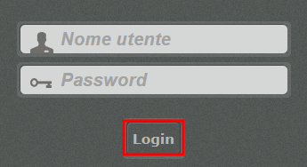

.. |IMG5| image:: static/Gestione_dei_contenuti_[Federica]_4.png
   :height: 208 px
   :width: 560 px

.. |IMG8| image:: static/Gestione_dei_contenuti_[Federica]_7.png
   :height: 202 px
   :width: 624 px

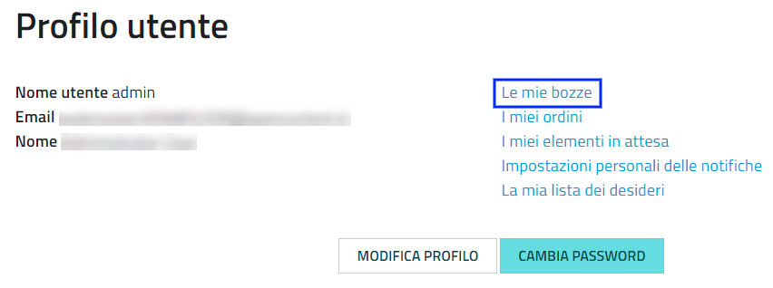

.. |IMG10| image:: static/Gestione_dei_contenuti_[Federica]_9.png
   :height: 153 px
   :width: 624 px

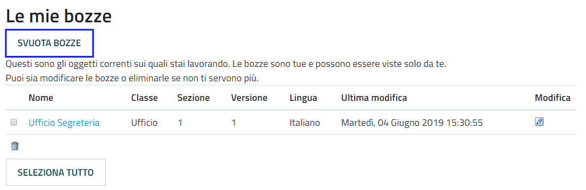

.. |IMG12| image:: static/Gestione_dei_contenuti_[Federica]_11.png
   :height: 193 px
   :width: 349 px

.. |IMG13| image:: static/Gestione_dei_contenuti_[Federica]_12.png
   :height: 134 px
   :width: 434 px

.. |IMG14| image:: static/Gestione_dei_contenuti_[Federica]_13.png
   :height: 46 px
   :width: 624 px

.. |IMG15| image:: static/Gestione_dei_contenuti_[Federica]_14.png
   :height: 46 px
   :width: 624 px

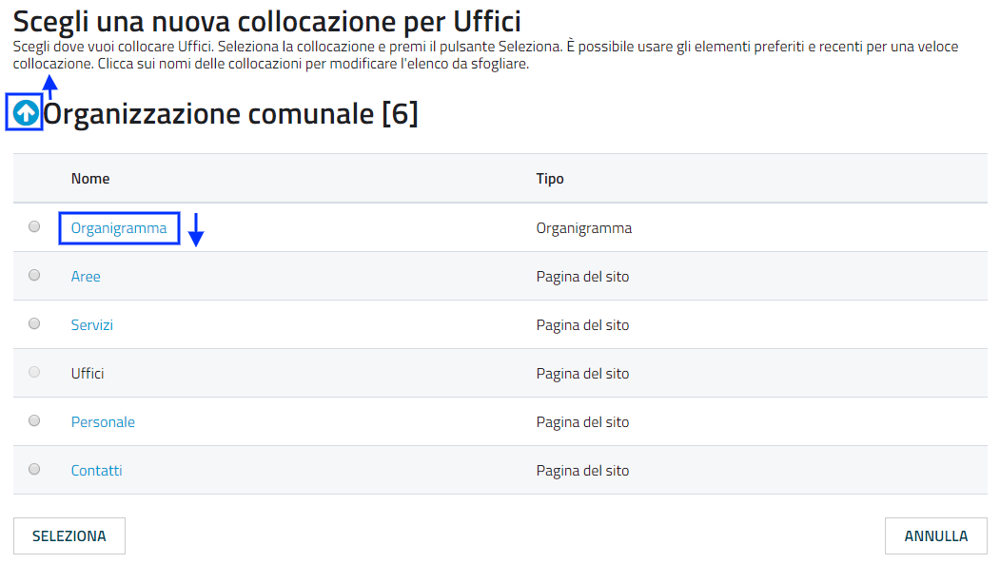

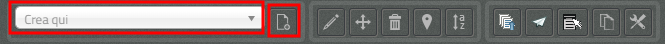

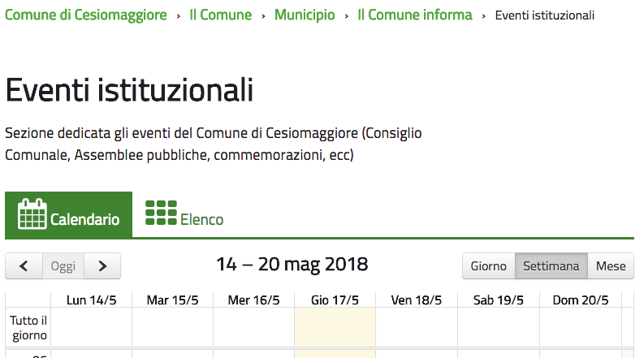

.. |IMG19| image:: static/Gestione_dei_contenuti_[Federica]_18.png
   :height: 228 px
   :width: 602 px

.. |IMG20| image:: static/Gestione_dei_contenuti_[Federica]_19.png
   :height: 238 px
   :width: 624 px

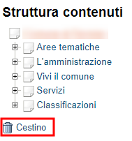

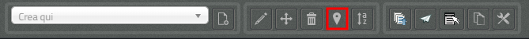

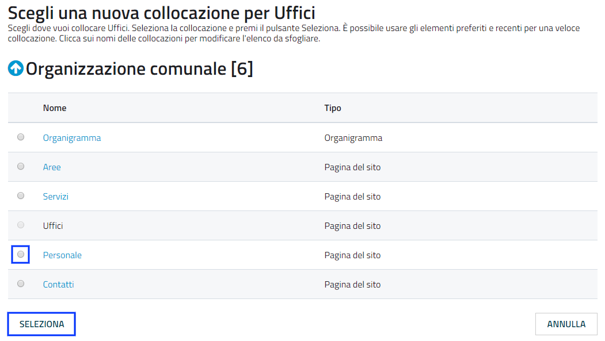

.. |IMG24| image:: static/Gestione_dei_contenuti_[Federica]_23.png
   :height: 317 px
   :width: 624 px

.. |IMG25| image:: static/Gestione_dei_contenuti_[Federica]_24.png
   :height: 42 px
   :width: 624 px

.. |IMG26| image:: static/Gestione_dei_contenuti_[Federica]_25.png
   :height: 364 px
   :width: 624 px

.. |IMG27| image:: static/Gestione_dei_contenuti_[Federica]_26.png
   :height: 305 px
   :width: 624 px

.. |IMG28| image:: static/Gestione_dei_contenuti_[Federica]_27.png
   :height: 42 px
   :width: 492 px

.. |IMG29| image:: static/Gestione_dei_contenuti_[Federica]_28.png
   :height: 45 px
   :width: 496 px

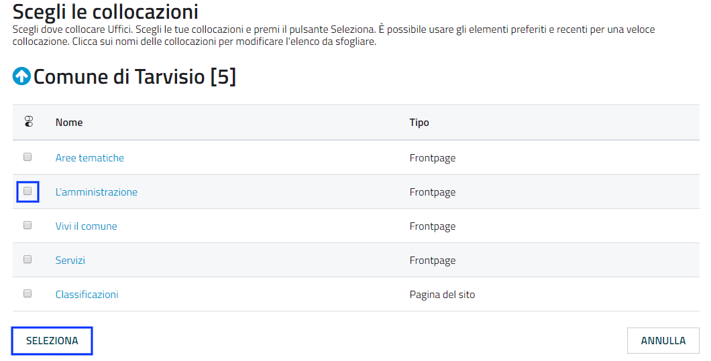

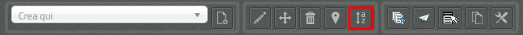

.. |IMG32| image:: static/Gestione_dei_contenuti_[Federica]_31.png
   :height: 42 px
   :width: 492 px

.. |IMG34| image:: static/Gestione_dei_contenuti_[Federica]_7.png
   :height: 202 px
   :width: 624 px

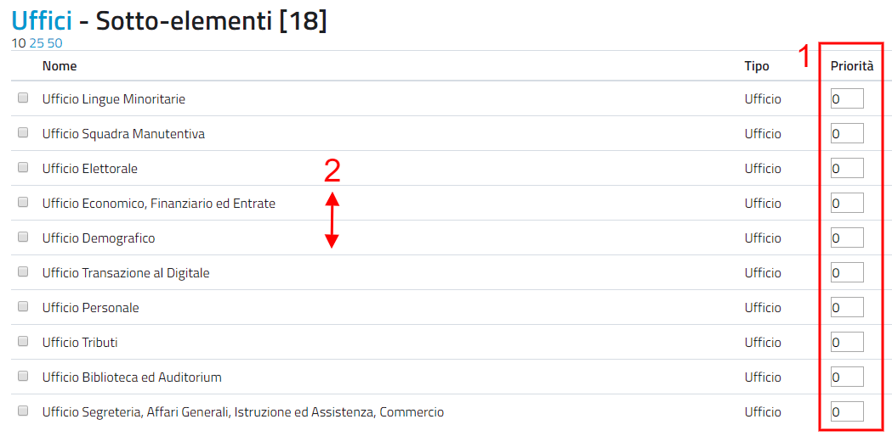

.. |IMG38| image:: static/Gestione_dei_contenuti_[Federica]_35.png
   :height: 190 px
   :width: 624 px

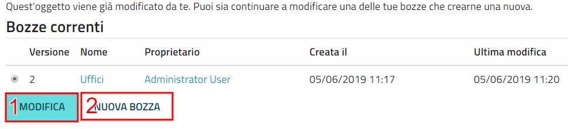

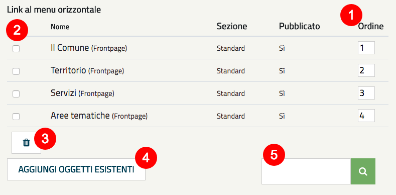

.. |IMG41| image:: static/Gestione_dei_contenuti_[Federica]_38.png
   :height: 102 px
   :width: 624 px

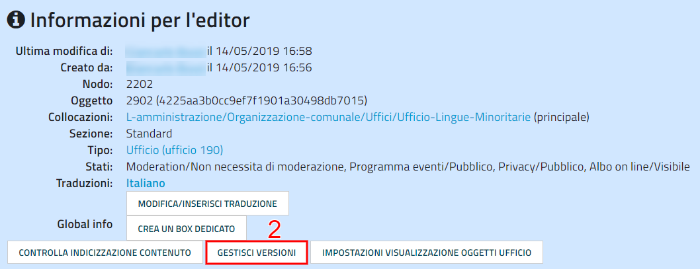

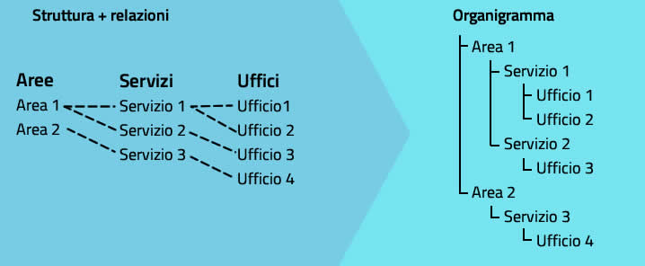

.. |IMG44| image:: static/Gestione_dei_contenuti_[Federica]_41.png
   :height: 185 px
   :width: 474 px

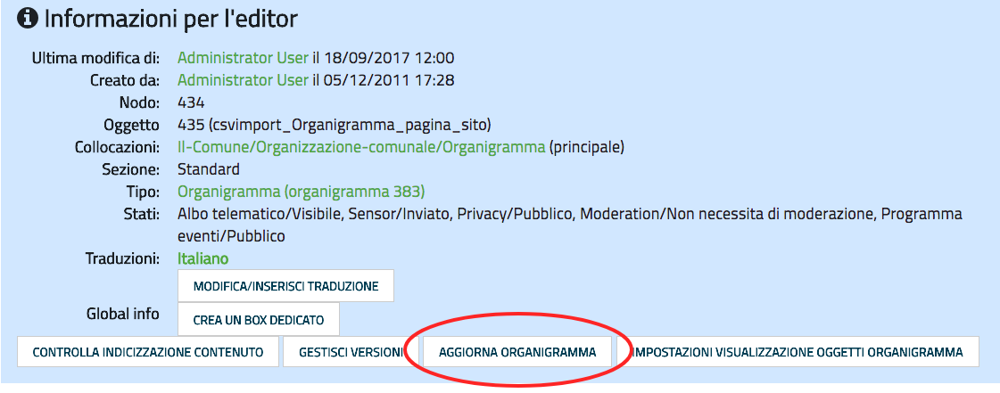
