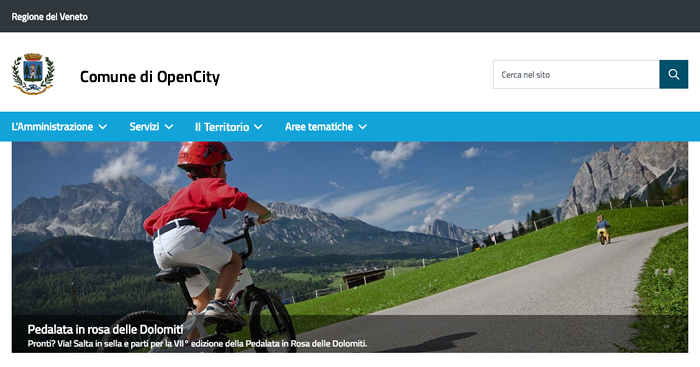
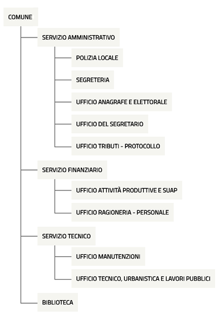

.. _h524ac94c195862726953433f2f5c7f:

Gestire i contenuti: l’interfaccia di amministrazione
*****************************************************

Lo scopo di questo capitolo è presentare una panoramica delle parti più comuni dell'\ |STYLE0|\  presente su tutti i siti appartenenti alla suite OpenPA (basati su piattaforma eZ Publish). L'interfaccia di amministrazione è composta da molte parti. Questo capitolo non tratta argomenti avanzati, ma si concentra sulle parti che sono maggiormente utilizzate da persone che si occupano della \ |STYLE1|\ .

.. _h67645d52877726a1e7944731371540:

Accesso al sistema 
===================

Ogni volta che si vuole accedere per la prima volta all’interfaccia di amministrazione, verrà visualizzata la schermata di accesso.

\ |IMG1|\ 

Questa pagina costituisce un meccanismo di sicurezza che impedisce agli utenti non autorizzati di accedere al sistema.

Per superare la pagina di accesso, il visitatore deve fornire un nome utente e una password validi.

\ |IMG2|\ 

Per avere un nome utente e una password validi, devi essere un utente registrato. 

Dopo aver digitato il nome utente e la password corretti, fai clic sul pulsante \ |STYLE2|\  ("Accedi"):

\ |IMG3|\ 

Nel caso in cui le informazioni fornite (Username o Password) non siano valide (o non siano corrette), verrà mostrato il seguente messaggio:

\ |IMG4|\ 

\ |STYLE3|\ 

.. _hf464843526245477320527c5120671:

Panoramica
==========

.. _h1f75163cc3b75124fa683052e4d0:

Pannello strumenti
------------------

Dopo aver effettuato correttamente il \ |LINK1|\ , l'interfaccia di amministrazione sarà, per impostazione predefinita, la pagina \ |STYLE4|\ .

\ |IMG5|\ 

\ |IMG6|\ 

Il Pannello Strumenti è l'\ |STYLE5|\ . Questa area consente di accedere a diversi elementi e interfacce che appartengono all'utente che ha effettuato l'accesso.

.. admonition:: Nota

    \ |STYLE6|\ 

.. _h2f6451396a283a194b374719425122:

Struttura contenuti
-------------------

La seguente schermata mostra la pagina che appare quando si fa clic sulla scheda \ |STYLE7|\ . Questa è l'area in cui, come redattore, trascorrerai la maggior parte del tuo tempo, aggiungendo e modificando i contenuti.

\ |IMG7|\ 

\ |IMG8|\ 

\ |STYLE8|\ 

Come mostrato sopra, l'interfaccia può essere divisa in 8 zone. Queste zone sono interattive e saranno sempre presenti. Sono gli elementi principali dell'interfaccia di amministrazione. Si noti che alcune zone verranno automaticamente disabilitate quando un utente attiva un'azione specifica (ad esempio, alcune parti dell'interfaccia non sono interattive durante la modifica).

L'interfaccia è composta dai seguenti elementi:

#. Menù principale

#. Menù \ |STYLE9|\  (“briciole di pane”)

#. Menù secondario

#. Area principale

#. Sotto-elementi

#. Menù a destra comprimibile

#. Motore di ricerca

#. Uscita

.. admonition:: Nota

    * Le frecce indicano le aree regolabili dello schermo. 
    
    * La freccia centrale destra indica il pulsante che permette di comprimere/espandere il menù di destra. 
    
    * La freccia centrale sinistra indica il pulsante che permette di regolare i margini del menù a sinistra. 
    
    * La freccia in alto a sinistra indica il pulsante che permette di comprimere/espandere il contenuto dell'area principale. Riducendo quest'area, si nasconde l'area centrale della scheda selezionata.

#. Menu principale

\ |IMG9|\ 

Il menu principale è una raccolta di schede situate tra il logo "eZ Publish" e il motore di ricerca. Il menu secondario (3) e l'area principale (4) mostrano gli elementi che appartengono alla scheda selezionata. Si noti che queste tre schede funzionano allo stesso modo. L'unica differenza è che danno accesso a diverse parti dell'albero dei nodi. Le schede rimanenti funzionano in modo diverso.

La seguente tabella fornisce una breve panoramica delle voci di menu disponibili insieme a una breve descrizione.

+------------------+---------------------------------------------------------------------------------------------------------------------------------------------------------------------------------------------------------------------------------------------------------------------------------------------------------------------------------------------------------------------------------------------------------------------------------------------------------------------------------------------------------------------------------------------------------------------------------------------------------------------------------------------------------------------------------------------------------+
|Voce del menù     |Descrizione                                                                                                                                                                                                                                                                                                                                                                                                                                                                                                                                                                                                                                                                                              |
+==================+=========================================================================================================================================================================================================================================================================================================================================================================================================================================================================================================================================================================================================================================================================================================+
|Pannello strumenti|Corrisponde all’\ |STYLE10|\  dell’utente. Quest’area consente di accedere a diversi elementi e interfacce che appartengono all'utente che ha effettuato l'accesso.                                                                                                                                                                                                                                                                                                                                                                                                                                                                                                                                      |
|                  |                                                                                                                                                                                                                                                                                                                                                                                                                                                                                                                                                                                                                                                                                                         |
|                  |                                                                                                                                                                                                                                                                                                                                                                                                                                                                                                                                                                                                                                                                                                         |
|                  |                                                                                                                                                                                                                                                                                                                                                                                                                                                                                                                                                                                                                                                                                                         |
+------------------+---------------------------------------------------------------------------------------------------------------------------------------------------------------------------------------------------------------------------------------------------------------------------------------------------------------------------------------------------------------------------------------------------------------------------------------------------------------------------------------------------------------------------------------------------------------------------------------------------------------------------------------------------------------------------------------------------------+
|\ |STYLE11|\      |Questa scheda porta l'utente in cima all'\ |STYLE12|\ . L’albero dei contenuti corrisponde ad una rappresentazione dei contenuti presenti sul sito web pubblico che si diramano a partire dalla pagina principale (spesso, l’Homepage).                                                                                                                                                                                                                                                                                                                                                                                                                                                                  |
|                  |                                                                                                                                                                                                                                                                                                                                                                                                                                                                                                                                                                                                                                                                                                         |
|                  |Se abilitato, il menù di sinistra (3) mostrerà invece un albero interattivo contenente i nodi che appartengono all'albero dei contenuti. L'area principale (4) visualizzerà le informazioni sul nodo di livello superiore selezionato insieme con un elenco di nodi collocati direttamente sotto di esso (5).                                                                                                                                                                                                                                                                                                                                                                                            |
+------------------+---------------------------------------------------------------------------------------------------------------------------------------------------------------------------------------------------------------------------------------------------------------------------------------------------------------------------------------------------------------------------------------------------------------------------------------------------------------------------------------------------------------------------------------------------------------------------------------------------------------------------------------------------------------------------------------------------------+
|\ |STYLE13|\      |La scheda Media (o “Libreria multimediale”) porta l'utente in cima all'\ |STYLE14|\ . Questa sezione può essere utilizzata per archiviare dati utilizzati frequentemente da altri nodi. Viene in genere utilizzato per archiviare \ |STYLE15|\ , \ |STYLE16|\  e \ |STYLE17|\  correlati ai nodi che si trovano nell'albero dei contenuti. La sezione non è accessibile all’utente esterno. Se abilitato, il menù di sinistra (3) mostrerà invece un albero interattivo contenente i nodi che appartengono all'albero dei contenuti. L'area principale (4) visualizzerà le informazioni sul nodo di livello superiore selezionato insieme con un elenco di nodi collocati direttamente sotto di esso (5).|
+------------------+---------------------------------------------------------------------------------------------------------------------------------------------------------------------------------------------------------------------------------------------------------------------------------------------------------------------------------------------------------------------------------------------------------------------------------------------------------------------------------------------------------------------------------------------------------------------------------------------------------------------------------------------------------------------------------------------------------+
|\ |STYLE18|\      |La scheda Account utenti pporta l'utente in cima all'\ |STYLE19|\ . Lo scopo di questo albero è quello di memorizzare utenti e gruppi di utenti in modo strutturato.  Se abilitato, il menù di sinistra (3) mostrerà invece un albero interattivo contenente i nodi che appartengono all'albero dei contenuti. L'area principale (4) visualizzerà le informazioni sul nodo di livello superiore selezionato insieme con un elenco di nodi collocati direttamente sotto di esso (5).                                                                                                                                                                                                                      |
+------------------+---------------------------------------------------------------------------------------------------------------------------------------------------------------------------------------------------------------------------------------------------------------------------------------------------------------------------------------------------------------------------------------------------------------------------------------------------------------------------------------------------------------------------------------------------------------------------------------------------------------------------------------------------------------------------------------------------------+
|\ |STYLE20|\      |La scheda Impostazioni porta l'utente nell'\ |STYLE21|\  principale. Questa area è per \ |STYLE22|\ .                                                                                                                                                                                                                                                                                                                                                                                                                                                                                                                                                                                                    |
+------------------+---------------------------------------------------------------------------------------------------------------------------------------------------------------------------------------------------------------------------------------------------------------------------------------------------------------------------------------------------------------------------------------------------------------------------------------------------------------------------------------------------------------------------------------------------------------------------------------------------------------------------------------------------------------------------------------------------------+

.. _h2c1d74277104e41780968148427e:

#. Menù breadcrumb (“briciole di pane”)

\ |IMG10|\ 

Percorso interattivo (2) situato proprio sotto le schede del menu principale (1). Questo percorso rivelerà sempre la posizione in cui l'utente è attualmente a prescindere dal contenuto/funzionalità a cui si accede. Il percorso è costituito da parole separate da barre. Tutti tranne l'ultimo elemento sono collegamenti, questo significa che il percorso può essere utilizzato per navigare all'indietro.

#. Menù secondario

\ |IMG11|\ 

Il menù secondario consente di accedere al contenuto e/o alle interfacce associate alla scheda selezionata nel menu principale (1). Il menù a sinistra delle prime tre schede ("Struttura contenuti", "Media" e "Account utenti") si presenta e si comporta allo stesso modo. Queste schede forniscono \ |STYLE23|\ . Quando la scheda "Struttura  contenuti" è selezionata, il menù a sinistra darà accesso all'albero dei contenuti, quando è selezionata la sezione "Media”, il menù a sinistra darà accesso all'albero dei media, ecc. Il menù a sinistra, per le schede rimanenti, si comporta diversamente e dà accesso a diverse interfacce. A differenza delle rappresentazioni ad albero, questo menù non può essere disabilitato e quindi sarà sempre visualizzato.

#. Area principale

\ |IMG12|\ L'area principale è la parte più dinamica e più importante dell'interfaccia di amministrazione. Visualizza il contenuto effettivo e/o le interfacce associate all'ultima menù selezionato. Questo è dove la maggior parte del lavoro del redattore viene svolto.

#. Sotto-elementi

\ |IMG13|\ 

L'area dei sotto-elementi visualizza le pagine secondarie, le cartelle, i contenuti multimediali, gli oggetti utente o altri oggetti contenuti all’interno della pagina principale selezionata.

L'elenco dei sotto-elementi (chiamati anche “\ |STYLE24|\ ”) ha una funzione di ordinamento che permette di ordinare i “figli” come si desidera. 

Si noti che le schede "Struttura contenuti", "Media" e "Account utenti" sono predefinite con un diverso set predefinito di colonne nella tabella dei sotto-elementi. Queste colonne possono essere personalizzate dall'utente in "Opzioni tabella" come descritto nella documentazione della scheda Struttura contenuti.

#. Menù a destra comprimibile

\ |IMG14|\ 

L'area destra è dedicata all'utente che ha effettuato l'accesso. Si tratta di un menù comprimibile. FaI clic sull'icona con la freccia per espandere/comprimere il menù. 

Questo menù rivela il nome dell'utente e fornisce collegamenti che possono essere utilizzati per modificare le informazioni e la password dell'utente. La sezione \ |STYLE25|\  contiene un elenco dei segnalibri dell'utente corrente. Questi sono i segnalibri interni al sito web che si è deciso di aggiungere. Fornisce anche un pulsante che può essere utilizzato per contrassegnare con un segnalibro il nodo attualmente visualizzato (“Aggiungi ai segnalibri”). La parte inferiore del menù a destra contiene inoltre strumenti per sviluppatori.

#. Motore di ricerca

\ |IMG15|\ 

Il motore di ricerca si trova nell'angolo in alto a destra. È sempre presente e può essere utilizzato per la ricerca indipendentemente dalla sezione in cui ci si trova. Il motore di ricerca viene disabilitato ogni volta che l'interfaccia è in modalità \ |STYLE26|\  (ad esempio, quando un oggetto viene modificato). 

Il comportamento predefinito del motore di ricerca è che il sistema cercherà le parole specificate all'interno dell'intero albero dei nodi. 

Il pulsante di opzione "Nella stessa collocazione" consente di limitare la ricerca solo a uno dei tre principali nodi (e a tutti gli elementi sottostanti) che viene visualizzato in quel momento (es.: Struttura contenuti, Media, Utenti).

\ |IMG16|\ 

#. Uscita

\ |IMG17|\ 

Il pulsante \ |STYLE27|\  può essere utilizzato per terminare la sessione disconnettendosi dal sistema.

.. _h2c1d74277104e41780968148427e:

 

.. _h2c1d74277104e41780968148427e:

.. _hd759192e2e61373d44567e1748202a:

Gestire i contenuti: l’interfaccia del redattore
************************************************

.. _hf464843526245477320527c5120671:

Panoramica
==========

L'\ |STYLE28|\  di un sito OpenPA semplifica la creazione e la gestione dei contenuti del sito web da parte degli utenti redattori. Si integra nel front-end del sito web, rendendo la gestione dei contenuti \ |STYLE29|\ . \ |STYLE30|\ 

Su OpenPA ci sono due modalità che permettono per lavorare con i contenuti del sito: l’\ |STYLE31|\  e l’\ |STYLE32|\ .

* \ |STYLE33|\ 

La maggior parte del lavoro, su un sito OpenPA - basato su piattaforma eZ Publish -, avviene tramite l’\ |STYLE34|\ . Gli elementi di questa interfaccia vengono visualizzati solo dagli utenti che appartengono a un gruppo con privilegi, per esempio, di \ |STYLE35|\  o \ |STYLE36|\ . Pertanto, gli ospiti del sito, anche se sono registrati, non possono accedere all'interfaccia del redattore. 

Fai riferimento alla sezione "\ |LINK2|\ " per istruzioni su come accedere all'interfaccia del redattore.

L'accesso e l'utilizzo delle funzioni di gestione dei contenuti nell'interfaccia del redattore è descritto nella sezione "\ |LINK3|\ ".

* \ |STYLE37|\ 

Le attività amministrative più complesse, come la \ |STYLE38|\  e la \ |STYLE39|\ , vengono eseguite tramite l'interfaccia di amministrazione. Generalmente solo gli utenti avanzati, come amministratori di siti e webmaster, devono utilizzare l'interfaccia di amministrazione. Tutte le attività di modifica che possono essere eseguite tramite l'interfaccia del redattore possono anche essere eseguite tramite l'interfaccia di amministrazione.

.. _h6e4d39105a64461f4f3377d353919:

Accesso al sistema
==================

Per accedere al sistema è necessario spostarsi in fondo alla pagina  e cliccare sul pulsante \ |STYLE40|\ .

\ |IMG18|\ 

Inserisci il tuo nome utente e password e quindi fai clic sul pulsante \ |STYLE41|\ .

\ |IMG19|\ 

Nel caso in cui le informazioni fornite (Username o Password) non siano valide (o non siano corrette), verrà mostrato il seguente messaggio:

\ |IMG20|\ 

\ |STYLE42|\ 

Se l’accesso invece va a buon fine, comparirà in alto la \ |STYLE43|\  del redattore e in fondo alla pagina i link \ |STYLE44|\ , \ |STYLE45|\  e \ |STYLE46|\ .\ |IMG21|\ 

.. _h45a7b11202953692f35174c5752c5b:

Gestione del profilo utente
===========================

I dettagli personali e le preferenze dell'account associati a un account utente sono chiamati "Profilo utente". Per visualizzare o modificare il proprio profilo utente, utilizzare l'interfaccia del redattore. 

.. _h254773682e787c2a7342801623527c28:

Modifica il tuo profilo
-----------------------

Una volta effettuato l’\ |LINK4|\ , l'interfaccia del sito web può essere utilizzata per modificare alcune delle informazioni personali nel tuo profilo utente. Dopo aver effettuato l'accesso, fai clic sul link \ |STYLE47|\  posizionato (per impostazione predefinita) nell'angolo in basso a destra della pagina. Verrà visualizzata una pagina che mostra le impostazioni correnti e contiene collegamenti a pagine in cui è possibile configurare le preferenze (descritte di seguito). Per modificare le tue informazioni personali, fai clic sul pulsante Modifica profilo.

\ |IMG22|\ 

.. _h543db5213201f7057203255d54b46:

Gestione delle bozze
--------------------

Una \ |STYLE48|\  è un contenuto che è stato inserito in eZ Publish ma che non è ancora stato pubblicato. Le bozze possono essere nuovi contenuti o modifiche a contenuti esistenti. I visitatori del sito non possono vedere il contenuto della bozza, ma l'utente che ha creato la bozza può \ |STYLE49|\ .

Per visualizzare tutte le pagine in cui sono state salvate le bozze:

\ |LINK5|\  come descritto sopra.

\ |IMG23|\ 

Clicca sul link Le mie bozze.

\ |IMG24|\ 

Fai clic sul nome di una bozza (o sul pulsante Modifica sul lato destro della bozza) per riprendere la modifica.

\ |IMG25|\ 

Verrà visualizzata l'interfaccia di \ |LINK6|\  standard. Dopo aver apportato le modifiche, puoi \ |LINK7|\  o \ |LINK8|\  per la successiva modifica.

Per eliminare le bozze, fai clic sul pulsante Svuota bozze.

\ |IMG26|\ 

\ |IMG27|\ 

.. _h1f184e272f67487d30753a697b3c5351:

Gestione dei contenuti
======================

Questa sezione spiega come aggiungere, modificare e rimuovere contenuti utilizzando l'\ |LINK9|\ . Per gestire il contenuto, è necessario aver effettuato l'\ |LINK10|\  con diritti di modifica (per impostazione predefinita, bisogna essere un membro dei gruppi Editors o Administrators).

.. _h497a677b162fd472225582d202823a:

Informazioni sui contenuti
--------------------------

Tutti i siti web basati sulla piattaforma hanno un forte orientamento alla \ |STYLE50|\ . La strutturazione dei dati e, quindi, la gestione dei contenuti avviene attraverso le cosiddette classi di contenuto. 

I siti appartenenti alla suite OpenPA supportano vari tipi di contenuto, come immagini, articoli, file multimediali, forum, moduli di feedback, ecc. 

Alcune tipologie di contenuto sono in comune tra tutti i prodotti della suite OpenPA, mentre altre tipologie sono specifiche per il prodotto (es.: OpenCity, OpenTrasparenza, etc.).

Un particolare tipo di contenuto è chiamato una \ |STYLE51|\ , mentre uno specifico contenuto è chiamato \ |STYLE52|\ .

.. _h46721d953744a52045c4d7212313d:

Classe di contenuto
~~~~~~~~~~~~~~~~~~~

.. admonition:: Definizione

    Una \ |STYLE53|\  di contenuto è una \ |STYLE54|\ . 

Una \ |STYLE55|\  può essere pensata come un \ |STYLE56|\  \ |LINK11|\  \ |STYLE57|\ . Ad esempio, la classe di contenuto dell'Avviso contiene attributi come titolo, data di pubblicazione, breve descrizione, testo dell’avviso, ecc. Sebbene non tutti questi attributi siano obbligatori, fanno tutti parte della classe di contenuto dell'avviso, quindi tutti gli oggetti di contenuto basati su questa classe possono contenere dati per tutti gli attributi definiti dalla classe di contenuto.

.. _h1d4c543776b648667653d412d7421:

Oggetto di contenuto
~~~~~~~~~~~~~~~~~~~~

Gli \ |STYLE58|\  possono essere sia \ |STYLE59|\  sia \ |STYLE60|\  che contengono altri oggetti situati al di sotto di essi nell’\ |LINK12|\ . Ad esempio, uno o più oggetti di tipo \ |STYLE61|\  (\ |STYLE62|\ ) possono essere memorizzati sotto un oggetto di tipo \ |STYLE63|\  (\ |STYLE64|\ ). Quando viene visualizzato l'oggetto \ |STYLE65|\ , questo visualizza automaticamente un elenco di riepilogo degli oggetti di tipo Avviso memorizzati al di sotto di esso.

Ogni classe di contenuto ha un modello diverso per la visualizzazione degli attributi di un oggetto di contenuto. Pertanto, solo perché un oggetto contenuto è memorizzato sotto un altro oggetto contenuto nell’albero dei contenuto non significa che l'oggetto contenuto inferiore verrà visualizzato quando viene visualizzato l'oggetto di contenuto più alto. Ad esempio, se "Articolo B" si trova al di sotto di "Articolo A", "Articolo B" non verrà visualizzato quando viene visualizzato "Articolo A", poiché la visualizzazione di elementi situati nella gerarchia inferiore non fa parte del modello di classe del contenuto dell'articolo.

Oltre alle caratteristiche di visualizzazione definite dal modello di ogni classe di contenuto, alcuni oggetti di contenuto possono visualizzare altri oggetti posizionati in qualsiasi punto del sito. Ad esempio, è possibile "incorporare" oggetti in altri oggetti (ad esempio, incorporare un'immagine in un articolo) utilizzando lo strumento di collegamento nell'editor online (descritto di seguito). La classe di contenuto sia dell'oggetto sorgente (in questo esempio, l'articolo) che dell'oggetto oggetto di inclusione (in questo caso l'immagine) determina se consente o meno l'incorporamento dell'oggetto. (Ad esempio, non è possibile incorporare una cartella in un'immagine, non è consentita dalla classe di contenuto Immagine).

.. _h28216c314279776926c20056637b7:

Attributi
~~~~~~~~~

Ogni \ |LINK13|\  è composta da una serie di voci o campi da compilare (\ |STYLE66|\ ) che rappresenta le principali caratteristiche che quel tipo di contenuto ha.

Per esempio, facendo riferimento alla classe Tasso di assenza, gli attributi che compongono la tipologia di contenuto sono quelli che sono stati individuati come caratteristiche principali di un contenuto di tipo Tasso di assenza (Anno di riferimento, Trimestre, Mese, Contratto, Numero dipendenti, Giorni di presenza, Giorni di assenza, Allegato, Data di archiviazione).

\ |IMG28|\ 

\ |STYLE67|\  \ |STYLE68|\  \ |STYLE69|\ 

Ogni classe di contenuto è costituita da \ |STYLE70|\  - che variano da una classe all’altra - (ad esempio “Titolo”, “Testo”, “Data di inizio validità”, “Ufficio proponente”) e che vanno compilati in fase di \ |LINK14|\  e/o \ |LINK15|\  dei contenuti: \ |STYLE71|\ .

\ |IMG29|\ 

 \ |STYLE72|\ 

.. _h10604b402c4d5175152c3fd415e671a:

Tipologie di attributi
~~~~~~~~~~~~~~~~~~~~~~

Alcuni attributi possono essere di tipo “\ |STYLE73|\ ”, perché \ |STYLE74|\ . 

Nel caso della circolare, ad esempio, uno degli attributi si chiama “Ufficio proponente”. In fase di compilazione di quel campo non si scriverà il nome dell’ufficio proponente, ma si cercherà tra gli oggetti di tipo “Ufficio” già censiti all’interno del sistema, per selezionare quello che rappresenta l’ufficio responsabile per quella circolare.

Uno dei vantaggi di questo approccio è che le informazioni vengono salvate e mantenute in un unico punto. Si pensi ad esempio al numero di telefono di un ufficio: esso è salvato nell’oggetto che rappresenta quell’ufficio. Quando viene pubblicato un avviso e si vuole indicare una modalità per richiedere maggiori informazioni, anziché scrivere un numero di telefono direttamente nell’avviso, viene inserito un link verso l’ufficio, che detiene l’informazione.

Se il numero dell’ufficio cambia, non è necessario eseguire un tedioso “trova e sostituisci” all’interno dei contenuti del sito, ma basta aggiornare i contenuti dell’oggetto Ufficio.

.. admonition:: Un sistema per la mappatura della realtà

    Le classi di contenuto servono per avere una mappatura quasi uno a uno tra contenuti del sistema web e la realtà. Questo presenta numerosi vantaggi, come ad esempio la facilità di organizzare ricerche mirate (solo su determinate tipologie di contenuto) o l’esportazione dei contenuti in formato Open Data. 

\ |IMG30|\ 

.. _h92d5457251d2e4e1d3b3fa7e26d39:

Albero dei contenuti
~~~~~~~~~~~~~~~~~~~~

La \ |STYLE75|\  è un concetto importante quando si creano nuovi contenuti. Se si fa affidamento su oggetti di contenuto più in alto nella gerarchia per visualizzare il nuovo contenuto che si sta aggiungendo, è probabile che si desideri aggiungere il nuovo contenuto sotto il contenitore del contenuto. Ad esempio, se si desidera che un oggetto contenuto della cartella visualizzi automaticamente un elenco di articoli, tali articoli devono trovarsi al di sotto dell'oggetto contenuto della cartella. È possibile aggiungere manualmente un collegamento a un articolo nel testo di un oggetto contenuto della cartella; tuttavia, se elimini l'articolo, il link verrà interrotto.

.. _h7c2b7466704f1f106c504a672c3d3750:

La barra degli strumenti
------------------------

Quando si effettua l'accesso con un account utente appartenente al gruppo Editor o Amministratore, la barra degli strumenti del sito web (mostrata sotto) viene visualizzata in ogni pagina del sito.

La barra degli strumenti consente di disporre delle funzionalità di \ |STYLE76|\  direttamente sulle pagine del sito (senza bisogno di accedere all’\ |LINK16|\ ). In questo modo è possibile navigare il sito come un normale visitatore, operare modifiche a contenuti esistenti, spostare contenuti, dargli un ordine oppure creare nuovi contenuti.

.. _h10c4c574a71225403a60d515a1572:

\ |IMG31|\ -----------

\ |STYLE77|\ 

.. admonition:: Importante

    Le azioni che è possibile svolgere attraverso l’uso della barra degli strumenti \ |STYLE78|\  in quel momento: ad esempio se si sta visualizzando un contenuto di tipo “Avviso” e si clicca sull’icona con la matita (modifica), verrà modificato esattamente quel contenuto, la stessa cosa vale per la creazione di nuovi contenuti, la cancellazione, e così via.

I pulsanti disponibili dalla barra degli strumenti del sito Web variano a seconda che l'account utente appartenga all'editor o al gruppo di amministratori. Se appartiene al gruppo Editor, sono disponibili solo i pulsanti applicabili nel contesto corrente. Inoltre, i pulsanti visualizzati dagli Editor sono limitati in base ai diritti concessi al gruppo di utenti Editor. (Tutti i pulsanti invece vengono visualizzati dagli utenti che appartengono al gruppo di utenti Administrator.)

Oltre ai pulsanti visualizzati, anche le classi di contenuti visualizzate nell'elenco a discesa possono variare a seconda che l'account utente appartenga a un editor o a un gruppo di amministratori.

.. admonition:: L’albero dei contenuti

    Nel sistema Open City, i contenuti sono organizzati in una struttura ad albero. Ogni contenuto ha una sua collocazione nell’albero dei contenuti. Questo va tenuto in considerazione quando viene creato un nuovo contenuto, perché esso va creato nella posizione corretta all’interno di un albero. Fanno eccezioni le immagini, che idealmente vengono create in un unico contenitore (Media/Images) per poter poi essere riutilizzate all’interno dei contenuti del sito.

La barra degli strumenti permette di eseguire le seguenti operazioni sui contenuti:

* \ |LINK17|\ 

* \ |LINK18|\ 

* \ |LINK19|\ 

* \ |LINK20|\ 

* \ |LINK21|\ 

* \ |LINK22|\ 

* \ |STYLE79|\  è possibile caricare dei files dal proprio pc (immagini, documenti pdf), che vengono convertiti in contenuti (seguendo una mappatura file/contenuto definita a livello di configurazione);

* \ |STYLE80|\  nel caso in cui il menù non mostra le modifiche apportate, è possibile forzare un refresh della visualizzazione del menù stesso;

* \ |STYLE81|\  per copiare un contenuto;

* \ |STYLE82|\  per accedere all’interfaccia di amministrazione e guardare “dietro le quinte”;

* \ |STYLE83|\  consente di tradurre un contenuto;

* \ |STYLE84|\  apre (o chiude) il box con informazioni sul contenuto che si sta visualizzando (data di creazione,  autore, tipologia di contenuto, …)

.. _h2c1d74277104e41780968148427e:

.. _h446e1e74f406341a17187e2023342b:

Creare un nuovo contenuto
~~~~~~~~~~~~~~~~~~~~~~~~~

\ |IMG32|\ 

La creazione di un contenuto avviene nel seguente modo:

Si naviga il sito fino a raggiungere il contenitore all’interno del quale si vuole creare il contenuto, ad esempio un calendario:

\ |IMG33|\ 

Dalla tendina nella barra degli strumenti (1), è possibile filtrare le tipologie di contenuto (2) e  selezionare il tipo di contenuto da creare (3). Infine si preme sul pulsante Crea qui (4):

\ |IMG34|\ 

\ |STYLE85|\  \ |STYLE86|\ \ |STYLE87|\ 

.. admonition:: Attenzione!

    Siccome le azioni svolte attraverso la barra degli strumenti \ |STYLE88|\  in quel momento, è molto importante fare attenzione al contenitore in cui ci si trova nel momento in cui si clicca il pulsante \ |STYLE89|\ : il contenuto verrà creato esattamente lì.

Una volta effettuate queste operazioni, il sistema presenta una interfaccia identica a quella di modifica di un contenuto, con la differenza che i campi (attributi) saranno tutti vuoti.

.. admonition:: Attributi obbligatori

    Nelle interfacce di creazione e modifica dei contenuti, alcuni degli attributi sono marcati con un asterisco. Questo significa che è obbligatorio compilare quegli attributi.

Una volta compilati i campi, pubblicare il contenuto oppure salvarlo come bozza.

.. _h623b12807a5967151285b15636b763e:

Modificare un contenuto esistente
~~~~~~~~~~~~~~~~~~~~~~~~~~~~~~~~~

\ |IMG35|\ 

Per modificare un contenuto esistente, è sufficiente \ |STYLE90|\  che si desidera modificare attraverso i menu e i link del sito, esattamente come farebbe un visitatore. Una volta raggiunto il contenuto da modificare, \ |STYLE91|\  e si passa alla modalità di modifica del contenuto: viene mostrata l’\ |STYLE92|\ , \ |STYLE93|\  \ |LINK23|\  di quel particolare contenuto.

.. _h6f797b5ae124496622133f2621740:

Spostare un contenuto
~~~~~~~~~~~~~~~~~~~~~

\ |IMG36|\ 

Per spostare il contenuto da una posizione a un'altra sul sito, utilizzare il pulsante \ |STYLE94|\  nella barra degli strumenti del sito web. Dopo aver fatto clic su Sposta, sarai in grado di esplorare il sito web e scegliere la nuova posizione per il contenuto.

\ |IMG37|\ 

Puoi scegliere il nuovo contenitore facendo clic sul pulsante di opzione accanto al nome o fare clic sul nome del contenitore per visualizzare il contenuto all’interno del contenitore.

Dopo aver selezionato la nuova posizione, fare clic sul pulsante \ |STYLE95|\ .

\ |IMG38|\ 

\ |STYLE96|\ 

#. Se sposti un contenitore di contenuti, il sistema sposta anche qualsiasi contenuto sotto quell'oggetto. Ad esempio, se sposti una cartella contenente articoli da una posizione a un'altra, tutti gli articoli verranno spostati.

#. Lo spostamento del contenuto dipende dai permessi dell’utente.

.. _h5e68755539e37045648426c163d17:

Eliminare un contenuto
~~~~~~~~~~~~~~~~~~~~~~

\ |IMG39|\ 

I siti di OpenPA utilizzano un contenitore denominato \ |STYLE97|\ . Quando rimuovi il contenuto, in realtà lo stai spostando nel contenitore del Cestino. Può essere ripristinato in qualsiasi momento fino a quando il Cestino non viene svuotato.

Per rimuovere il contenuto, selezionare l'oggetto desiderato e fare clic sul pulsante \ |STYLE98|\  sulla barra degli strumenti del sito Web. In alternativa, per i contenuti incorporati, fare clic sul pulsante Elimina vicino all'oggetto contenuto.

Ti verrà richiesto di specificare se il contenuto deve essere spostato nel cestino o eliminato completamente:

\ |STYLE99|\ 

\ |IMG40|\ 

\ |STYLE100|\ 

\ |IMG41|\ 

Fai molta attenzione durante la rimozione e l'eliminazione dei contenuti, poiché queste azioni influiscono anche sugli altri contenuti del sito:

* Se rimuovi un contenitore, verranno rimossi anche gli elementi contenuti al suo interno. Ad esempio, se rimuovi la cartella contenente articoli, rimuovi anche gli articoli.

* Se ci sono collegamenti al contenuto, quando rimuovi il contenuto i collegamenti vengono interrotti.

.. _h7df7c776b4051050602379363f7c45:

Recuperare del contenuto dal cestino
~~~~~~~~~~~~~~~~~~~~~~~~~~~~~~~~~~~~

Per recuperare il contenuto rimosso dal contenitore del cestino, accedere all'\ |LINK24|\  e fare clic sull'icona del cestino sul lato sinistro.

\ |IMG42|\ 

Il contenitore del cestino ha una struttura "piatta", il che significa che tutti gli oggetti sono elencati allo stesso livello indipendentemente dalla loro posizione nella gerarchia del contenuto originale.

Per ripristinare un oggetto contenuto dal cestino, fai clic sull'icona a forma di matita nella colonna a destra. Verrà richiesto se si desidera ripristinare l'oggetto nella posizione originale o in una nuova posizione. Dopo aver specificato il percorso, fare clic su Ok.

Se si tenta di recuperare un contenuto il cui contenitore originale è stato rimosso, si è obbligati a scegliere una nuova posizione per esso.

.. _h2240736754442d35296a627136282576:

Visualizzare un contenuto in più posti
~~~~~~~~~~~~~~~~~~~~~~~~~~~~~~~~~~~~~~

\ |IMG43|\ 

Come visto in precedenza, ogni contenuto del sito ha una collocazione in una struttura ad albero. La funzionalità \ |STYLE101|\  consente di rendere uno stesso contenuto visibile in più sezioni del sito. Lo stesso oggetto di contenuto può infatti avere più collocazioni all'interno dell'albero dei contenuti. 

Per pubblicare un contenuto in una posizione aggiuntiva, accedere alla pagina desiderata, quindi fare clic sul pulsante \ |STYLE102|\ .

Dopo aver fatto clic sul pulsante, verrà visualizzato il nodo di livello superiore dell'albero dei contenuto. 

\ |IMG44|\ 

Fare clic sui nodi contenitore evidenziati per navigare nell'albero fino a raggiungere la posizione in cui si desidera pubblicare il contenuto. Quando hai trovato la nuova posizione, seleziona la casella e fai clic sul pulsante \ |STYLE103|\ .

\ |IMG45|\ 

.. _h186d3e232255c2d71724e1d376f4d6c:

Ordinare un elenco di contenuti
~~~~~~~~~~~~~~~~~~~~~~~~~~~~~~~

\ |IMG46|\ 

Quando si hanno diversi oggetti di contenuto in un contenitore, è possibile disporli e visualizzarli in un ordine ben preciso.

Esistono molti modi diversi per ordinare un elenco di contenuti. Questa sezione mostra un metodo, che può essere applicato alle preferenze di ordinamento più comuni (per esempio: manualmente, in ordine alfabetico o per data).

Dopo aver effettuato l’\ |LINK25|\ , individua il contenitore dei contenuti a cui desideri dare un ordinamento e clicca sul pulsante \ |STYLE104|\ .

\ |IMG47|\ 

\ |STYLE105|\ 

* \ |STYLE106|\ : ordine alfabetico ascendente (dalla A alla Z) oppure discendente (dalla Z alla A)

* \ |STYLE107|\ : ordine cronologico in base alla data di pubblicazione ascendente (dal primo pubblicato all’ultimo) oppure discendente (dall’ultimo pubblicato al primo)

* \ |STYLE108|\ : in questa modalità è possibile ordinare i contenuti manualmente in base alla priorità che gli si vuole affidare. La priorità può essere impostata come ascendente (dal numero più basso al più alto) oppure discendente (dal numero più alto al più basso). Può essere impostata sia attraverso l’inserimento di numeri interi nella sezione a destra “Priorità” (1) oppure attraverso il trascinamento manuale (2).

\ |IMG48|\ 

.. _h2c1d74277104e41780968148427e:

.. _h767585962235668053c5e40387877:

Gestire la pubblicazione di un contenuto
----------------------------------------

.. _h3a185351287965787e58745836626238:

Pubblicare un contenuto
~~~~~~~~~~~~~~~~~~~~~~~

\ |IMG49|\ 

Durante la \ |LINK26|\  o la \ |LINK27|\ , dopo aver inserito tutte le informazioni che desideri inserire, puoi pubblicare il tuo contenuto attraverso il pulsante \ |STYLE109|\ , che si trova sia in alto sia in fondo sulla destra.

.. _h135b1173858785b746a581212b213a:

Salvare una bozza
~~~~~~~~~~~~~~~~~

\ |IMG50|\ 

Quando lavori su un oggetto, puoi salvare il tuo lavoro senza renderlo visibile subito sul sito web. Quando si crea una \ |STYLE110|\ , la versione “bozza” dell'oggetto viene salvata senza essere pubblicata. Per salvare una bozza, fai clic sul pulsante \ |STYLE111|\  nella \ |LINK28|\ : questo ti permetterà di salvare il tuo lavoro e di continuare a lavorare sulla tua bozza; se invece vuoi salvare una bozza ma preferisci continuare a lavorarci in un secondo momento, clicca su \ |STYLE112|\ .

\ |IMG51|\ 

Esistono due metodi per recuperare le bozze: accedere alla pagina \ |LINK29|\  nel tuo profilo o \ |LINK30|\  precedentemente pubblicata. 

#. Se l'oggetto contenuto non è stato pubblicato in precedenza, seleziona \ |STYLE113|\  dall'angolo in basso a destra di qualsiasi pagina, quindi seleziona \ |LINK31|\ . Verrà visualizzata una pagina con tutte le bozze.

#. Per continuare invece a lavorare su una bozza di un oggetto che è stato precedentemente pubblicato, è possibile in alternativa \ |LINK32|\  semplicemente l'oggetto contenuto esistente. Dopo aver fatto clic sul pulsante Modifica, avrai la possibilità di modificare la versione corrente - quella pubblicata - creando quindi una nuova bozza (2) oppure di continuare a modificare la bozza precedentemente creata (1).

\ |IMG52|\ 

.. _hf307a4b362627629761f2e7d26b63:

Annullare una bozza
~~~~~~~~~~~~~~~~~~~

\ |IMG53|\ 

Durante la \ |LINK33|\  o la \ |LINK34|\ , puoi decidere di annullare il lavoro apportato, eliminando la bozza creata. Questo non influirà in alcun modo sul contenuto eventualmente già pubblicato, ma eliminerà semplicemente la bozza contenente le nuove informazioni apportate. Per farlo clicca il pulsante \ |STYLE114|\ , che si trova sia in alto sia in fondo sulla sinistra.

Un altro modo per eliminare le bozze, è quello di \ |LINK35|\ , cliccare su \ |LINK36|\  e fare clic sul pulsante Svuota bozze.

\ |IMG54|\ 

\ |IMG55|\ 

Se invece vuoi eliminare definitivamente un contenuto dal sito vai nella sezione \ |LINK37|\ .

.. _h803704e74727f3f1969533867f4b16:

Gestire le versioni di un contenuto
-----------------------------------

Nei siti di OpenPA, ogni contenuto creato viene memorizzato come "\ |STYLE115|\ ". Ad esempio, un articolo è un oggetto, un account utente è un oggetto e così via.

Quando si \ |LINK38|\ , viene assegnato un \ |STYLE116|\  (es.: 1). Se si modifica l'oggetto, viene assegnato un nuovo numero di versione (es.: 2, 3 e così via). Sia l'originale che le nuove versioni dell'oggetto vengono memorizzate nel database.

Grazie a questo sistema di controllo delle versioni, è possibile \ |STYLE117|\ . Ad esempio, se una nuova versione di un oggetto contiene un errore, è possibile ripristinare l'oggetto alla versione precedente.

Solo un numero limitato di versioni di ciascun oggetto contenuto viene memorizzato nel database (per evitare che il database diventi troppo grande). Nel caso dei siti di OpenPA vengono memorizzate al massimo 10 versioni precedenti dell’oggetto pubblicato.

.. _h709111e6d7c634a5217577b23a7033:

Ripristinare una versione precedente di un oggetto
~~~~~~~~~~~~~~~~~~~~~~~~~~~~~~~~~~~~~~~~~~~~~~~~~~

Per ripristinare una versione precedente di un oggetto, \ |LINK39|\ , quindi accedere al contenuto che si desidera ripristinare. (Per impostazione predefinita, solo i membri dei gruppi Editor e Administrator hanno accesso a questa funzione.)

Clicca sul pulsante Informazioni per l’editor (in alto a destra, sulla barra degli strumenti)

\ |IMG56|\ 

Clicca sul pulsante Gestisci versioni.

\ |IMG57|\ 

Seleziona la casella accanto alla versione desiderata dell'oggetto e fai clic sul pulsante Copia della versione “Archiviata” che desideri ripristinare.

\ |IMG58|\ 

Questo creerà una nuova bozza. Fai clic sul pulsante Modifica per modificare la nuova bozza appena creata. 

\ |IMG59|\ 

Fai clic sul pulsante \ |STYLE118|\  per pubblicare l’oggetto e ripristinare così la sua versione precedente. Se lo desideri, puoi comunque modificare l'oggetto prima di pubblicare la versione ripristinata.

La nuova versione (3) sostituirà la versione corrente (2). La versione dell'oggetto che hai appena sostituito invece rimarrà comunque nel database delle versioni precedenti come “Archiviata” e potrà essere ripristinata nello stesso modo appena descritto.

.. bottom of content

.. |STYLE0| replace:: **interfaccia di amministrazione**

.. |STYLE1| replace:: **gestione dei contenuti**

.. |STYLE2| replace:: **Login**

.. |STYLE3| replace:: *Messaggio di accesso non riuscito*

.. |STYLE4| replace:: **Pannello Strumenti**

.. |STYLE5| replace:: **area personale degli utenti**

.. |STYLE6| replace:: *La prossima volta che effettui il login, la pagina iniziale sarà, per impostazione predefinita, la pagina in cui hai lavorato per ultima.*

.. |STYLE7| replace:: **Struttura contenuti**

.. |STYLE8| replace:: *Nota: le opzioni mostrate dipendono dai diritti dell'utente che accede.*

.. |STYLE9| replace:: *breadcrumb*

.. |STYLE10| replace:: **area personale**

.. |STYLE11| replace:: **Struttura contenuti**

.. |STYLE12| replace:: **albero dei contenuti**

.. |STYLE13| replace:: **Media**

.. |STYLE14| replace:: **albero dei Media**

.. |STYLE15| replace:: **immagini**

.. |STYLE16| replace:: **animazioni**

.. |STYLE17| replace:: **documenti**

.. |STYLE18| replace:: **Account utenti**

.. |STYLE19| replace:: **albero degli Utenti**

.. |STYLE20| replace:: **Impostazioni**

.. |STYLE21| replace:: **area di configurazione**

.. |STYLE22| replace:: **utenti esperti**

.. |STYLE23| replace:: **accesso a diverse parti dell'albero dei nodi**

.. |STYLE24| replace:: **figli**

.. |STYLE25| replace:: **Preferiti**

.. |STYLE26| replace:: *modifica*

.. |STYLE27| replace:: **Scollegati**

.. |STYLE28| replace:: **interfaccia**

.. |STYLE29| replace:: **intuitiva, facile da imparare e da utilizzare**

.. |STYLE30| replace:: **La maggior parte delle attività di gestione del sito web può essere eseguita tramite l'interfaccia del redattore.**

.. |STYLE31| replace:: **interfaccia del redattore (front-end)**

.. |STYLE32| replace:: **interfaccia di amministrazione (back-end)**

.. |STYLE33| replace:: **L'interfaccia del redattore**

.. |STYLE34| replace:: **interfaccia del redattore**

.. |STYLE35| replace:: **Editor**

.. |STYLE36| replace:: **Amministratore**

.. |STYLE37| replace:: **L'interfaccia di amministrazione**

.. |STYLE38| replace:: **gestione degli utenti**

.. |STYLE39| replace:: **progettazione del sito**

.. |STYLE40| replace:: **Accedi con il tuo account**

.. |STYLE41| replace:: **Login**

.. |STYLE42| replace:: *Messaggio di accesso non riuscito*

.. |STYLE43| replace:: **barra degli strumenti**

.. |STYLE44| replace:: **Profilo utente**

.. |STYLE45| replace:: **Strumenti**

.. |STYLE46| replace:: **Logout**

.. |STYLE47| replace:: **Profilo utente**

.. |STYLE48| replace:: **bozza**

.. |STYLE49| replace:: **accedervi, modificarla ed eventualmente pubblicarla**

.. |STYLE50| replace:: **strutturazione dei dati**

.. |STYLE51| replace:: **classe di contenuto**

.. |STYLE52| replace:: **oggetto di contenuto**

.. |STYLE53| replace:: **classe**

.. |STYLE54| replace:: **struttura dati predefinita che rappresenta una specifica tipologia di contenuto**

.. |STYLE55| replace:: **classe di contenuto**

.. |STYLE56| replace:: **modello per un particolare tipo di contenuto che esprime gli**

.. |STYLE57| replace:: **di quell'oggetto**

.. |STYLE58| replace:: **oggetti di contenuto**

.. |STYLE59| replace:: **singoli oggetti**

.. |STYLE60| replace:: **contenitori**

.. |STYLE61| replace:: **Avviso**

.. |STYLE62| replace:: *contenuti*

.. |STYLE63| replace:: **Pagina del sito**

.. |STYLE64| replace:: *contenitore*

.. |STYLE65| replace:: **Pagina del sito**

.. |STYLE66| replace:: **attributi**

.. |STYLE67| replace:: *La classe*

.. |STYLE68| replace:: **Tasso di assenza**

.. |STYLE69| replace:: *con i suoi attributi.*

.. |STYLE70| replace:: **attributi**

.. |STYLE71| replace:: **le interfacce di creazione e modifica di un contenuto sono infatti basate sugli attributi specifici di ogni classe di contenuto**

.. |STYLE72| replace:: *Interfaccia di creazione e di modifica di un contenuto*

.. |STYLE73| replace:: **Relazione oggetti**

.. |STYLE74| replace:: **mettono in relazione un oggetto con altri presenti nel sistema**

.. |STYLE75| replace:: **gerarchia dei contenuti**

.. |STYLE76| replace:: *content management*

.. |STYLE77| replace:: *La barra degli strumenti con le varie funzionalità*

.. |STYLE78| replace:: **sono contestuali al contenuto visualizzato**

.. |STYLE79| replace:: **Caricamento multiplo:**

.. |STYLE80| replace:: **Refresh menu:**

.. |STYLE81| replace:: **Copia:**

.. |STYLE82| replace:: **Interfaccia di amministrazione:**

.. |STYLE83| replace:: **Traduci:**

.. |STYLE84| replace:: **Informazioni sul contenuto:**

.. |STYLE85| replace:: *Creazione di un nuovo oggetto di tipo*

.. |STYLE86| replace:: **Evento**

.. |STYLE87| replace:: *.*

.. |STYLE88| replace:: **sono contestuali al contenuto visualizzato**

.. |STYLE89| replace:: **Crea qui**

.. |STYLE90| replace:: **navigare verso il contenuto**

.. |STYLE91| replace:: **si clicca sull’icona della matita**

.. |STYLE92| replace:: **interfaccia di modifica**

.. |STYLE93| replace:: **basata sugli attributi della**

.. |STYLE94| replace:: **Sposta**

.. |STYLE95| replace:: **Seleziona**

.. |STYLE96| replace:: **Informazioni tecniche**

.. |STYLE97| replace:: **Cestino**

.. |STYLE98| replace:: **Elimina**

.. |STYLE99| replace:: **Rimuovi il contenuto spostandolo nel cestino (predefinito)**

.. |STYLE100| replace:: **Cancella il contenuto de-selezionando la casella Sposta nel cestino**

.. |STYLE101| replace:: **Aggiungi collocazioni**

.. |STYLE102| replace:: **Aggiungi collocazioni**

.. |STYLE103| replace:: **Seleziona**

.. |STYLE104| replace:: **Ordina**

.. |STYLE105| replace:: **Modalità di ordinamento**

.. |STYLE106| replace:: **Nome**

.. |STYLE107| replace:: **Pubblicato**

.. |STYLE108| replace:: **Priorità**

.. |STYLE109| replace:: **Salva**

.. |STYLE110| replace:: **bozza**

.. |STYLE111| replace:: **Salva bozza**

.. |STYLE112| replace:: **Salva bozza e esci**

.. |STYLE113| replace:: **Profilo utente**

.. |STYLE114| replace:: **Annulla**

.. |STYLE115| replace:: **oggetto**

.. |STYLE116| replace:: **numero di versione**

.. |STYLE117| replace:: **ripristinare una versione precedente di un oggetto**

.. |STYLE118| replace:: **Salva**

.. |LINK1| raw:: html

    <a href="#heading=h.p3mrka7hvlgn">login</a>

.. |LINK2| raw:: html

    <a href="#heading=h.n4svwnvcjsjv">Gestione del profilo utente</a>

.. |LINK3| raw:: html

    <a href="#heading=h.puwcf7tgiycx">Gestione dei contenuti</a>

.. |LINK4| raw:: html

    <a href="#heading=h.n4svwnvcjsjv">accesso al sistema</a>

.. |LINK5| raw:: html

    <a href="#heading=h.llkhyy9sdqd2">Accedi al tuo profilo utente</a>

.. |LINK6| raw:: html

    <a href="#heading=h.1mcnduslphd4">modifica</a>

.. |LINK7| raw:: html

    <a href="#heading=h.juza122b5gfb">pubblicare l'oggetto</a>

.. |LINK8| raw:: html

    <a href="#heading=h.wnigikt1lo9g">salvarlo di nuovo come bozza</a>

.. |LINK9| raw:: html

    <a href="#heading=h.nwxpw7bjnq2z">interfaccia del redattore</a>

.. |LINK10| raw:: html

    <a href="#heading=h.n4svwnvcjsjv">accesso come utente</a>

.. |LINK11| raw:: html

    <a href="#heading=h.q57u6ojsxflq">attributi</a>

.. |LINK12| raw:: html

    <a href="#heading=h.joqishgpytei">albero dei contenuto</a>

.. |LINK13| raw:: html

    <a href="#heading=h.p2ynpnmf2tr2">classe di contenuto</a>

.. |LINK14| raw:: html

    <a href="#heading=h.drjohrpw70wm">creazione</a>

.. |LINK15| raw:: html

    <a href="#heading=h.1mcnduslphd4">modifica</a>

.. |LINK16| raw:: html

    <a href="#heading=h.jtp4r2o0ttqb">interfaccia di amministrazione</a>

.. |LINK17| raw:: html

    <a href="#heading=h.ndkcfao9d0rv">Creare un nuovo contenuto</a>

.. |LINK18| raw:: html

    <a href="#heading=h.1mcnduslphd4">Modificare un contenuto esistente</a>

.. |LINK19| raw:: html

    <a href="#heading=h.i26rv2rivw43">Spostare un contenuto</a>

.. |LINK20| raw:: html

    <a href="#heading=h.ql3gqguzc4sb">Eliminare un contenuto</a>

.. |LINK21| raw:: html

    <a href="#heading=h.mjbri5bl04ul">Visualizzare un contenuto in più posti</a>

.. |LINK22| raw:: html

    <a href="#heading=h.10opsef29is">Ordinare un elenco di contenuti</a>

.. |LINK23| raw:: html

    <a href="#heading=h.ru6obljf61tc">classe di contenuto</a>

.. |LINK24| raw:: html

    <a href="#heading=h.jtp4r2o0ttqb">interfaccia di amministrazione</a>

.. |LINK25| raw:: html

    <a href="#heading=h.n4svwnvcjsjv">accesso al sistema</a>

.. |LINK26| raw:: html

    <a href="#heading=h.drjohrpw70wm">creazione un nuovo contenuto</a>

.. |LINK27| raw:: html

    <a href="#heading=h.1mcnduslphd4">modifica di un contenuto già esistente</a>

.. |LINK28| raw:: html

    <a href="#heading=h.1mcnduslphd4">pagina di modifica</a>

.. |LINK29| raw:: html

    <a href="#heading=h.h9pifzd4qg2c">Le mie bozze</a>

.. |LINK30| raw:: html

    <a href="#heading=h.1mcnduslphd4">modificare una pagina</a>

.. |LINK31| raw:: html

    <a href="#heading=h.h9pifzd4qg2c">Le mie bozze</a>

.. |LINK32| raw:: html

    <a href="#heading=h.1mcnduslphd4">modificare</a>

.. |LINK33| raw:: html

    <a href="#heading=h.drjohrpw70wm">creazione un nuovo contenuto</a>

.. |LINK34| raw:: html

    <a href="#heading=h.1mcnduslphd4">modifica di un contenuto già esistente</a>

.. |LINK35| raw:: html

    <a href="#heading=h.rvrai39cv162">accedere al tuo Profilo utente</a>

.. |LINK36| raw:: html

    <a href="#heading=h.h9pifzd4qg2c">Le mie bozze</a>

.. |LINK37| raw:: html

    <a href="#heading=h.ql3gqguzc4sb">Eliminare un contenuto</a>

.. |LINK38| raw:: html

    <a href="#heading=h.drjohrpw70wm">crea un nuovo oggetto</a>

.. |LINK39| raw:: html

    <a href="#heading=h.n4svwnvcjsjv">accedere al sistema</a>

.. |IMG2| image:: static/2_2.png
   :height: 188 px
   :width: 344 px

.. |IMG3| image:: static/2_3.png
   :height: 188 px
   :width: 344 px

.. |IMG4| image:: static/2_4.png
   :height: 178 px
   :width: 561 px

.. |IMG6| image:: static/2_6.png
   :height: 253 px
   :width: 624 px

.. |IMG7| image:: static/2_7.png
   :height: 41 px
   :width: 624 px

.. |IMG8| image:: static/2_8.jpeg
   :height: 309 px
   :width: 624 px

.. |IMG9| image:: static/2_9.png
   :height: 38 px
   :width: 624 px

.. |IMG10| image:: static/2_10.png
   :height: 117 px
   :width: 602 px

.. |IMG11| image:: static/2_11.png
   :height: 576 px
   :width: 624 px

.. |IMG12| image:: static/2_12.png
   :height: 217 px
   :width: 624 px

.. |IMG13| image:: static/2_13.png
   :height: 106 px
   :width: 624 px

.. |IMG14| image:: static/2_14.png
   :height: 381 px
   :width: 174 px

.. |IMG15| image:: static/2_15.png
   :height: 78 px
   :width: 402 px

.. |IMG16| image:: static/2_16.png
   :height: 204 px
   :width: 613 px

.. |IMG17| image:: static/2_17.png
   :height: 62 px
   :width: 380 px

.. |IMG18| image:: static/2_18.png
   :height: 48 px
   :width: 624 px

.. |IMG19| image:: static/2_19.png
   :height: 341 px
   :width: 313 px

.. |IMG20| image:: static/2_20.png
   :height: 224 px
   :width: 429 px

.. |IMG21| image:: static/2_21.png
   :height: 49 px
   :width: 624 px

.. |IMG22| image:: static/2_21.png
   :height: 49 px
   :width: 624 px

.. |IMG23| image:: static/2_22.png
   :height: 22 px
   :width: 624 px

.. |IMG24| image:: static/2_23.png
   :height: 208 px
   :width: 560 px

.. |IMG25| image:: static/2_24.png
   :height: 202 px
   :width: 624 px

.. |IMG26| image:: static/2_25.png
   :height: 202 px
   :width: 624 px

.. |IMG27| image:: static/2_26.png
   :height: 202 px
   :width: 624 px

.. |IMG28| image:: static/2_27.png
   :height: 368 px
   :width: 624 px

.. |IMG29| image:: static/2_28.png
   :height: 813 px
   :width: 601 px

.. |IMG30| image:: static/2_29.png
   :height: 916 px
   :width: 550 px

.. |IMG31| image:: static/2_30.png
   :height: 153 px
   :width: 624 px

.. |IMG32| image:: static/2_31.png
   :height: 41 px
   :width: 624 px

.. |IMG33| image:: static/2_32.png
   :height: 193 px
   :width: 349 px

.. |IMG34| image:: static/2_33.png
   :height: 134 px
   :width: 434 px

.. |IMG35| image:: static/2_34.png
   :height: 46 px
   :width: 624 px

.. |IMG36| image:: static/2_35.png
   :height: 46 px
   :width: 624 px

.. |IMG37| image:: static/2_36.png
   :height: 352 px
   :width: 624 px

.. |IMG38| image:: static/2_37.png
   :height: 352 px
   :width: 624 px

.. |IMG39| image:: static/2_38.png
   :height: 42 px
   :width: 624 px

.. |IMG40| image:: static/2_39.png
   :height: 228 px
   :width: 602 px

.. |IMG41| image:: static/2_40.png
   :height: 238 px
   :width: 624 px

.. |IMG42| image:: static/2_41.png
   :height: 201 px
   :width: 188 px

.. |IMG43| image:: static/2_42.png
   :height: 46 px
   :width: 624 px

.. |IMG44| image:: static/2_43.png
   :height: 317 px
   :width: 624 px

.. |IMG45| image:: static/2_44.png
   :height: 317 px
   :width: 624 px

.. |IMG46| image:: static/2_45.png
   :height: 42 px
   :width: 624 px

.. |IMG47| image:: static/2_46.png
   :height: 364 px
   :width: 624 px

.. |IMG48| image:: static/2_47.png
   :height: 305 px
   :width: 624 px

.. |IMG49| image:: static/2_48.png
   :height: 42 px
   :width: 492 px

.. |IMG50| image:: static/2_49.png
   :height: 45 px
   :width: 496 px

.. |IMG51| image:: static/2_50.png
   :height: 45 px
   :width: 496 px

.. |IMG52| image:: static/2_51.png
   :height: 142 px
   :width: 624 px

.. |IMG53| image:: static/2_52.png
   :height: 42 px
   :width: 492 px

.. |IMG54| image:: static/2_25.png
   :height: 202 px
   :width: 624 px

.. |IMG55| image:: static/2_26.png
   :height: 202 px
   :width: 624 px

.. |IMG56| image:: static/2_53.png
   :height: 29 px
   :width: 624 px

.. |IMG57| image:: static/2_54.png
   :height: 240 px
   :width: 624 px

.. |IMG58| image:: static/2_55.png
   :height: 204 px
   :width: 624 px

.. |IMG59| image:: static/2_56.png
   :height: 190 px
   :width: 624 px
